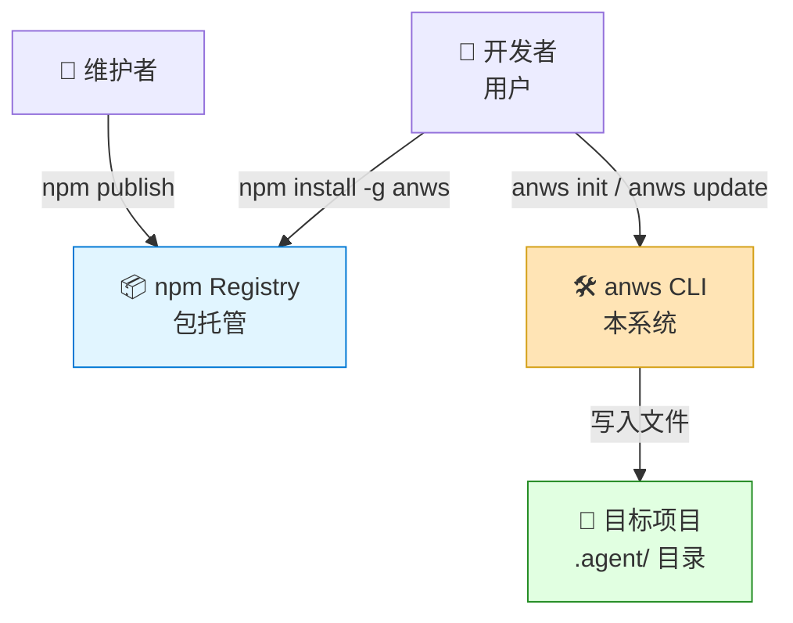
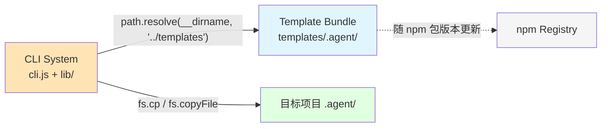
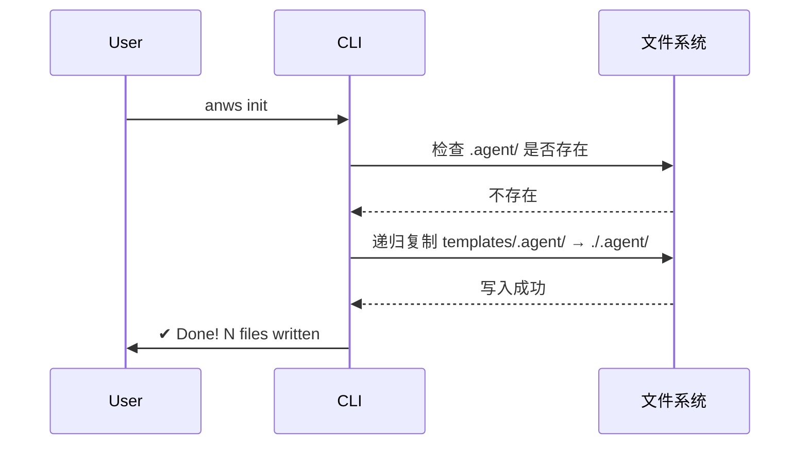
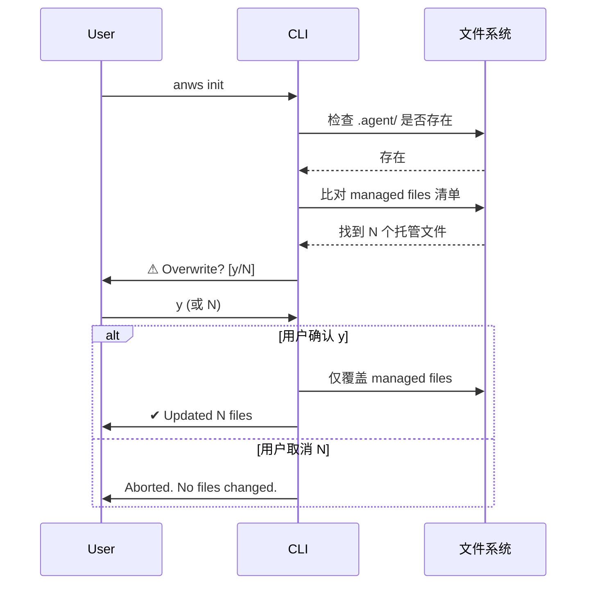

# 系统架构总览 (Architecture Overview)

**项目**: `anws` — Antigravity Workflow System CLI
**版本**: 1.0
**日期**: 2026-02-25
**关联 ADR**: `03_ADR/ADR_001_TECH_STACK.md`

---

## 1. 系统上下文 (System Context)

### 1.1 C4 Level 1 — 系统上下文图



### 1.2 关键角色 (Key Actors)

| 角色 | 描述 | 交互方式 |
|------|------|---------|
| **开发者 (用户)** | 想在项目中使用工作流系统的人 | 运行 `npm install -g anws`，然后 `anws init` |
| **维护者** | Antigravity 系统的开发和发布者 | 更新 templates，运行 `npm publish` |

### 1.3 外部系统 (External Systems)

| 系统 | 类型 | 交互 |
|------|------|------|
| npm Registry | 外部服务 | 维护者发布包；用户下载安装 |
| 目标项目文件系统 | 用户本地 | CLI 写入 `.agent/` 目录 |
| GitHub Releases | 外部服务（备选分发）| 维护者上传 `.zip`；用户手动下载 |

---

## 2. 系统清单 (System Inventory)

### System 1: CLI System
**系统 ID**: `cli-system`

**职责 (Responsibility)**:
- 解析命令行参数（`init` / `update` / `--version` / `--help`）
- 路由到对应命令处理器
- 处理用户交互（Y/N 确认）
- 输出格式化的终端反馈

**边界 (Boundary)**:
- **输入**: `process.argv` (命令行参数), 用户的 stdin 输入 (readline)
- **输出**: stdout 打印（文件列表、确认提示、错误信息）
- **依赖**: `template-bundle-system`（读取内嵌模板），目标项目文件系统（写入）

**关联需求**: [REQ-001] [REQ-002] [REQ-003] [REQ-004]

**技术栈**:
- Runtime: Node.js ≥ 18
- 参数解析: `node:util` parseArgs
- 交互: `node:readline`
- 文件操作: `node:fs/promises`, `node:path`
- 模块格式: CommonJS

**源码根目录**: `src/anws/bin/` + `src/anws/lib/`

**设计文档**: `04_SYSTEM_DESIGN/cli-system.md` (待创建)

---

### System 2: Template Bundle
**系统 ID**: `template-bundle`

**职责 (Responsibility)**:
- 存储 Antigravity Workflow System 的完整 `.agent/` 目录内容
- 内嵌于 npm 包，随包版本一起发布和更新
- 维护 **managed files 清单**（决定哪些文件属于我们管理）

**边界 (Boundary)**:
- **输入**: 维护者更新 `templates/.agent/` 内容 + `npm publish`
- **输出**: `cli-system` 读取后复制到目标项目
- **依赖**: 无（静态文件）

**关联需求**: [REQ-002] [REQ-003] [REQ-004] [REQ-007]

**技术栈**: 纯静态文件，无运行时技术

**源码根目录**: `src/anws/templates/`

**Managed Files 清单机制**:
清单维护在 `src/anws/lib/manifest.js` 中，列出所有属于本包的文件相对路径。更新时仅覆盖清单内的文件，清单外的用户文件不受影响。

**设计文档**: 无需单独设计文档（纯文件复制）

---

## 3. 系统边界矩阵 (System Boundary Matrix)

| 系统 | 输入 | 输出 | 依赖系统 | 被依赖 | 关联需求 |
|------|------|------|---------|--------|---------|
| CLI System | `argv`, `stdin` | `stdout`, 文件写入 | Template Bundle | — | REQ-001~004 |
| Template Bundle | 维护者更新文件 | 文件内容（供 CLI 读取） | — | CLI System | REQ-002~004, REQ-007 |

---

## 4. 系统依赖图 (System Dependency Graph)



---

## 5. 物理代码结构 (Physical Code Structure)

```
src/
└── anws/                          # npm 包根目录
    ├── package.json               # name: "anws", bin: { anws: "./bin/cli.js" }
    ├── README.md                  # 用户文档（安装、使用、GitHub 备选）
    ├── bin/
    │   └── cli.js                 # #!/usr/bin/env node — 主入口，parseArgs，命令路由
    ├── lib/
    │   ├── init.js                # anws init — 检测冲突、写入文件、打印摘要
    │   ├── update.js              # anws update — 更新托管文件
    │   ├── copy.js                # 通用递归文件复制工具
    │   └── manifest.js            # MANAGED_FILES 常量数组（托管文件清单）
    └── templates/
        └── .agent/                # 内嵌的完整工作流模板
            ├── workflows/
            │   ├── genesis.md
            │   ├── blueprint.md
            │   ├── forge.md
            │   └── ...
            ├── skills/
            │   └── ...
            └── rules/
                └── AGENTS.md

genesis/v1/                        # 架构文档（本目录，只读参考）
```

---

## 6. 核心执行流程 (Key Execution Flows)

### Flow A: `anws init`（无 `.agent/`）



### Flow B: `anws init`（`.agent/` 已存在）



### Flow C: `anws update`

与 Flow B 类似，但：
- 跳过"首次检查"，直接进入 managed files 比对
- 若 `.agent/` 不存在，打印错误建议运行 `anws init`

---

## 7. 拆分原则与理由 (Decomposition Rationale)

### 为什么只有 2 个系统？

`anws` 是一个**极简 CLI 工具**，本质上是"复制文件 + 用户确认"。拆分 3 个或更多系统会导致**过度设计**。

系统拆分标准（对照本项目）：

| 标准 | 本项目评估 |
|------|-----------|
| 技术栈差异 | CLI(Node.js代码) ≠ Template(静态文件) → 2个系统 ✓ |
| 独立部署 | CLI 和 Template 捆绑在同一 npm 包 → 无需额外拆分 |
| 职责差异 | CLI=执行逻辑，Template=数据 → 天然分离 |
| 变化频率 | Template 更新频繁，CLI 逻辑相对稳定 → 分离有价值 |

### 为什么没有"数据库系统"?

无状态 CLI 工具，所有"数据"就是文件，无需数据库。

### 为什么没有"后端 API 系统"?

纯本地工具，无网络请求（设计约束之一）。

---

## 8. 技术栈总览 (Technology Stack Overview)

| Layer | Technology | 用于 |
|-------|-----------|------|
| **CLI Runtime** | Node.js ≥ 18 | CLI System |
| **参数解析** | `node:util` parseArgs | CLI System |
| **交互 Prompt** | `node:readline` | CLI System |
| **文件操作** | `node:fs/promises`, `node:path` | CLI System |
| **模块格式** | CommonJS | CLI System |
| **包分发** | npm Registry | 两个系统 |
| **模板内容** | Markdown/JSON 静态文件 | Template Bundle |
