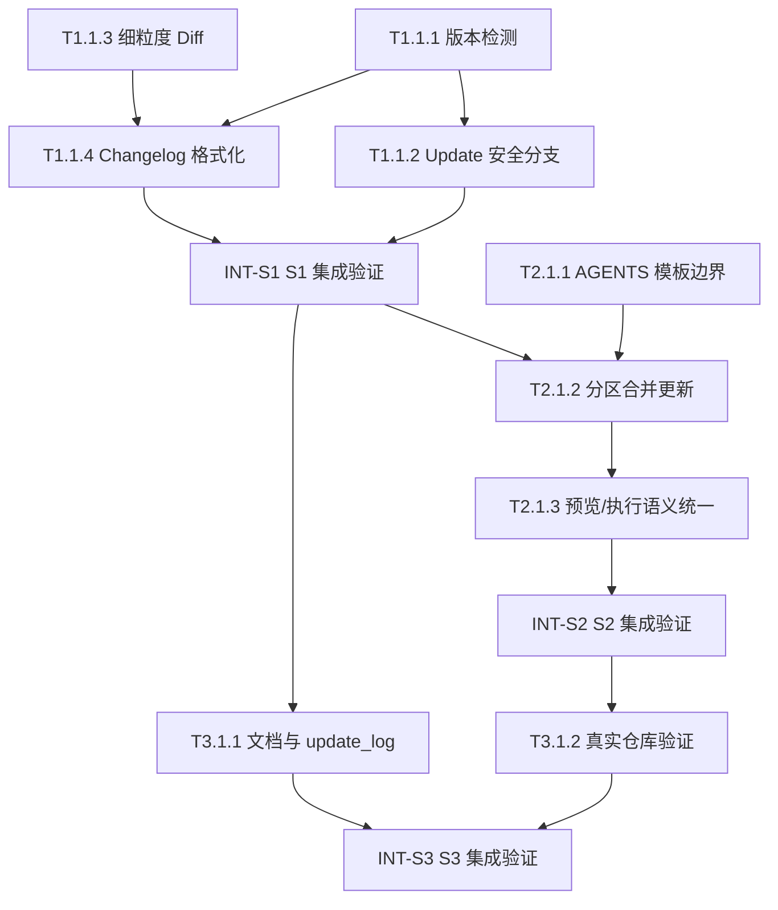

# 任务清单 - Genesis v3

> 本任务清单仅覆盖 `genesis/v3` 的增量目标：`anws update` 版本安全机制、细粒度 changelog/diff、以及 `AGENTS.md` 的分区更新能力。

---

## 📊 Sprint 路线图

| Sprint | 代号 | 核心任务 | 退出标准 | 预估 |
|--------|------|---------|---------|------|
| S1 | Safe Update Core | 版本检测 + 细粒度 diff + changelog 历史保护 | `anws update` / `anws update --check` 在同版本与有变更场景下行为一致，且不覆盖已有 changelog | 1-2d |
| S2 | Segmented AGENTS | 模板边界 + 分区合并更新 | 更新稳定提示词区时不破坏 `AUTO` 运行态区块，预览/执行/changelog 语义一致 | 1-2d |
| S3 | Upgrade Hardening | 文档收口 + 真实仓库验证 | legacy 仓库验证通过，升级路径对 `/upgrade` 可追溯 | 1d |

---

## 🔗 任务依赖图

---

## S1 - Safe Update Core

- [x] **T1.1.1** [REQ-004]: 实现 changelog 最新版本检测与 semver 比较
  - **描述**: 在 `src/anws/lib/changelog.js` 中实现最新已记录版本扫描、`vX.Y.Z.md` 解析与 semver 比较逻辑，返回 `needUpgrade`、`latestVersion`、`fromVersion` 等升级判定信息。
  - **输入**: `genesis/v3/01_PRD.md` 中 US04 / G8；`genesis/v3/03_ADR/ADR_003_CHANGELOG_SYSTEM.md` 决策 4；现有 `src/anws/lib/changelog.js`
  - **输出**: 可在 `update.js` 中复用的稳定版本检测函数
  - **验收标准**:
    - Given `anws/changelog/` 中存在多个 `vX.Y.Z.md`
    - When 调用版本检测逻辑
    - Then 能正确识别最新记录版本并返回是否需要升级
  - **验证类型**: 单元测试
  - **验证说明**: 运行针对 semver 比较和最新版本识别的测试，确认多版本与空目录场景都能得到正确结果
  - **估时**: 3h
  - **依赖**: 无

- [x] **T1.1.2** [REQ-004]: 在 update 命令中接入统一版本安全分支
  - **描述**: 在 `src/anws/lib/update.js` 中为 `anws update` 与 `anws update --check` 接入统一的版本检测入口；当最新记录版本等于当前 CLI 版本时，直接返回 `Already up to date.`，不进入覆盖或 changelog 写入流程。
  - **输入**: T1.1.1 产出的版本检测函数；`src/anws/lib/update.js`；`genesis/v3/01_PRD.md` US04 / G8
  - **输出**: 在正式更新与预览模式中行为一致的版本安全分支
  - **验收标准**:
    - Given 最新 changelog 版本已等于当前 CLI 版本
    - When 执行 `anws update` 或 `anws update --check`
    - Then 终端输出 `Already up to date.` 且不覆盖已有 changelog
  - **验证类型**: 集成测试
  - **验证说明**: 在测试仓库中分别执行 `update` 与 `update --check`，确认两条路径都直接返回且未写入新内容
  - **估时**: 4h
  - **依赖**: T1.1.1

- [x] **T1.1.3** [REQ-006]: 强化内容级 diff，输出逐行前后对比与上下文
  - **描述**: 在 `src/anws/lib/diff.js` 中强化逐行对齐算法，输出可用于终端预览和 changelog 持久化的细粒度差异信息，包含必要的前后文本与行号信息。
  - **输入**: `genesis/v3/01_PRD.md` US06；`genesis/v3/03_ADR/ADR_003_CHANGELOG_SYSTEM.md` 决策 2/3；现有 `src/anws/lib/diff.js`
  - **输出**: 细粒度 diff 摘要结构与稳定的预览输出
  - **验收标准**:
    - Given 模板文件与目标文件存在内容差异
    - When 生成 diff 预览
    - Then 输出展示逐行前后对比，且不引入无意义的伪差异噪音
  - **验证类型**: 单元测试
  - **验证说明**: 使用带新增、删除、修改、尾部空白差异的样例内容运行测试，确认输出结构与预期一致
  - **估时**: 4h
  - **依赖**: 无

- [x] **T1.1.4** [REQ-004]: 生成细粒度 changelog 升级记录
  - **描述**: 在 `src/anws/lib/changelog.js` 中把 T1.1.1 的版本安全机制与 T1.1.3 的细粒度 diff 摘要组合起来，生成 `/upgrade` 可消费的 `anws/changelog/vX.Y.Z.md`。
  - **输入**: T1.1.1 的版本检测函数；T1.1.3 的 diff 摘要结构；`genesis/v3/03_ADR/ADR_003_CHANGELOG_SYSTEM.md` changelog 格式规范
  - **输出**: 带文件级摘要与内容级详情的 changelog 生成逻辑
  - **验收标准**:
    - Given 本次升级存在新增或修改文件
    - When 生成 changelog
    - Then `vX.Y.Z.md` 包含文件级变更清单和内容级变更详情，且与终端预览语义一致
  - **验证类型**: 集成测试
  - **验证说明**: 在样例仓库执行一次升级并检查生成文件，确认 changelog 能准确表达本次变更
  - **估时**: 4h
  - **依赖**: T1.1.1, T1.1.3

- [x] **INT-S1** [MILESTONE]: S1 集成验证 — Safe Update Core
  - **描述**: 验证 S1 的退出标准，确认版本检测、细粒度 diff、changelog 保护在 `update` 与 `--check` 下协同正常。
  - **输入**: T1.1.1, T1.1.2, T1.1.3, T1.1.4 的产出
  - **输出**: S1 集成验证结果（通过/失败 + 问题清单）
  - **验收标准**:
    - Given S1 所有任务已完成
    - When 分别验证同版本、存在差异、空 changelog 目录三类场景
    - Then 所有检查通过，且无历史 changelog 被覆盖
  - **验证类型**: 集成测试
  - **验证说明**: 在测试仓库执行完整升级路径，逐项核对退出标准并记录结果
  - **估时**: 3h
  - **依赖**: T1.1.2, T1.1.4

---

## S2 - Segmented AGENTS

- [x] **T2.1.1** [REQ-004]: 重构 AGENTS 模板边界，明确稳定区与 AUTO 区块
  - **描述**: 在 `src/anws/templates/AGENTS.md` 中明确稳定提示词区与 `AUTO:BEGIN` / `AUTO:END` 运行态区块的结构边界，为后续分区合并更新提供程序可依赖的模板约束。
  - **输入**: `genesis/v3/01_PRD.md` G9；`genesis/v3/03_ADR/ADR_003_CHANGELOG_SYSTEM.md` 决策 5；现有 `src/anws/templates/AGENTS.md`
  - **输出**: 边界清晰、标记完整的 AGENTS 模板结构
  - **验收标准**:
    - Given 模板文件被读取
    - When 查找 `AUTO:BEGIN` 与 `AUTO:END`
    - Then 运行态区块边界唯一且完整，稳定提示词区与运行态区块职责分离
  - **验证类型**: 手动验证
  - **验证说明**: 阅读模板文件，确认工作流注册表、宪法等稳定内容位于区块外，运行态内容位于区块内
  - **估时**: 2h
  - **依赖**: 无

- [x] **T2.1.2** [REQ-004]: 实现 AGENTS.md 分区合并更新能力
  - **描述**: 在 `src/anws/lib/update.js` 或新的辅助模块中实现 `AGENTS.md` 的分区合并更新逻辑：仅更新区块外模板提示词，保留 `AUTO` 区块内项目运行态内容。
  - **输入**: T2.1.1 产出的模板边界；`src/anws/lib/update.js`；`src/anws/lib/agents.js`；真实 `AGENTS.md` 样例
  - **输出**: 可在升级时安全合并 `AGENTS.md` 的实现
  - **验收标准**:
    - Given 目标仓库存在带 `AUTO` 区块的 `AGENTS.md`
    - When 执行更新
    - Then 区块外模板提示词被更新，`AUTO` 区块内容保持不变
  - **验证类型**: 集成测试
  - **验证说明**: 使用带自定义运行态内容的 `AGENTS.md` 样例执行升级，比较更新前后区块内外内容
  - **估时**: 6h
  - **依赖**: T2.1.1, INT-S1

- [x] **T2.1.3** [REQ-004]: 统一 AGENTS 在预览、执行与 changelog 中的语义
  - **描述**: 统一 `AGENTS.md` 在 `--check` 预览、正式写入与 changelog 记录中的表现，避免预览报告“会修改”而实际执行跳过，或反之。
  - **输入**: T2.1.2 的分区合并逻辑；`src/anws/lib/update.js`；`src/anws/lib/changelog.js`
  - **输出**: 对 `AGENTS.md` 行为语义一致的预览/执行/记录逻辑
  - **验收标准**:
    - Given `AGENTS.md` 在本次升级中按规则应被跳过或部分更新
    - When 运行 `--check`、`update`、查看 changelog
    - Then 三者表达同一真实结果，不出现误导性差异
  - **验证类型**: 集成测试
  - **验证说明**: 在多种 AGENTS 状态下比较预览输出、实际文件结果与 changelog 内容，确认三者一致
  - **估时**: 4h
  - **依赖**: T2.1.2

- [x] **INT-S2** [MILESTONE]: S2 集成验证 — Segmented AGENTS
  - **描述**: 验证 S2 退出标准，确认分区更新不会破坏 `AUTO` 区块，且 AGENTS 相关预览/执行/changelog 三路语义一致。
  - **输入**: T2.1.1, T2.1.2, T2.1.3 的产出
  - **输出**: S2 集成验证结果（通过/失败 + 问题清单）
  - **验收标准**:
    - Given 带 legacy AGENTS 的真实或准真实仓库
    - When 执行分区更新相关验证
    - Then `AUTO` 区块保持完整，稳定区按预期更新，三路语义一致
  - **验证类型**: 集成测试
  - **验证说明**: 用真实仓库样例执行验证，记录 AGENTS 合并前后差异和终端/记录输出
  - **估时**: 3h
  - **依赖**: T2.1.3

---

## S3 - Upgrade Hardening

- [x] **T3.1.1** [REQ-007]: 收口 update 文档、升级文档与 release 记录
  - **描述**: 更新 `update_log.md`、README、以及与 `/upgrade` 相关的文档表述，使其与 v3 实现后的真实机制保持一致。
  - **输入**: `genesis/v3/01_PRD.md`；`genesis/v3/03_ADR/ADR_003_CHANGELOG_SYSTEM.md`；现有 `update_log.md` 与 README 文档
  - **输出**: 与实现一致的文档与 release 说明
  - **验收标准**:
    - Given v3 机制已完成
    - When 阅读 update 与 upgrade 相关文档
    - Then 版本安全、changelog 历史保护与 AGENTS 分区机制的描述一致且无自相矛盾内容
  - **验证类型**: 手动验证
  - **验证说明**: 通读更新后的文档，确认术语、流程和边界与实现一致
  - **估时**: 3h
  - **依赖**: INT-S1

- [x] **T3.1.2** [REQ-004]: 在真实 legacy 仓库上执行端到端验证
  - **描述**: 使用包含旧 `.agent/`、旧 `genesis/`、旧 `AGENTS.md` 的真实仓库样例进行 `update --check` 与 `update` 验证，确认兼容路径符合预期，且在 `.agent/` 迁移到 `.agents/` 后会提供是否删除 legacy `.agent/` 目录的交互确认。
  - **输入**: INT-S1 与 INT-S2 的实现产出；真实 legacy 仓库样例；`.tmp` 测试目录
  - **输出**: 端到端验证结果与剩余兼容性问题清单
  - **验收标准**:
    - Given legacy 仓库样例已准备好
    - When 执行 `anws update --check` 与 `anws update`
    - Then 版本检测、changelog、AGENTS 行为、legacy 兼容路径，以及 `.agent/` 删除确认交互都符合设计预期
  - **验证类型**: 手动验证
  - **验证说明**: 在真实仓库执行命令并人工核对文件变化、终端输出、`.agent/` 删除确认提示与 changelog 结果
  - **估时**: 4h
  - **依赖**: INT-S2

- [x] **INT-S3** [MILESTONE]: S3 集成验证 — Upgrade Hardening
  - **描述**: 汇总 S3 的发布前验收，确认 v3 的核心机制、文档与 legacy 兼容验证都已闭环。
  - **输入**: T3.1.1, T3.1.2 的产出
  - **输出**: 最终集成验证结果（通过/失败 + 剩余风险）
  - **验收标准**:
    - Given S3 任务已完成
    - When 对文档、CLI 行为、legacy 验证结果进行最终复核
    - Then v3 的核心机制具备进入后续发布/继续演进的条件
  - **验证类型**: 手动验证
  - **验证说明**: 汇总前两项任务的结果，逐条对照 Sprint 退出标准确认闭环
  - **估时**: 2h
  - **依赖**: T3.1.1, T3.1.2

---

## 🎯 User Story Overlay

### US01: 全局安装 CLI (P0)
**涉及任务**: 无新增任务（v1/v2 已覆盖）
**关键路径**: 已完成能力，v3 无新增变更
**独立可测**: ✅ 现有能力保留
**覆盖状态**: ✅ 完整

### US02: 初始化工作流系统 (P0)
**涉及任务**: 无新增任务（v1/v2 已覆盖）
**关键路径**: 已完成能力，v3 无新增变更
**独立可测**: ✅ 现有能力保留
**覆盖状态**: ✅ 完整

### US03: 冲突时安全询问 (P0)
**涉及任务**: T2.1.2 → T2.1.3
**关键路径**: T2.1.2 → T2.1.3
**独立可测**: ✅ S2 结束即可验证
**覆盖状态**: ✅ 完整

### US04: 更新工作流文件 (P1)
**涉及任务**: T1.1.1 → T1.1.2 → T1.1.4 → T2.1.2 → T2.1.3 → T3.1.2
**关键路径**: T1.1.1 → T1.1.2 → T1.1.4 → T2.1.2
**独立可测**: ✅ S2 结束即可演示，S3 做真实仓库闭环
**覆盖状态**: ✅ 完整

### US05: 通过 GitHub 下载（无 npm）(P1)
**涉及任务**: 无新增任务（v3 无变更）
**关键路径**: 已完成能力保留
**独立可测**: ✅ 不受 v3 影响
**覆盖状态**: ✅ 完整

### US06: 预检升级内容 (P1)
**涉及任务**: T1.1.1 → T1.1.2 → T1.1.3 → T1.1.4 → T2.1.3
**关键路径**: T1.1.1 → T1.1.2 → T1.1.3 → T1.1.4
**独立可测**: ✅ S1 结束即可演示
**覆盖状态**: ✅ 完整

### US07: AI 升级业务文档 (P2)
**涉及任务**: T1.1.4 → T3.1.1 → T3.1.2
**关键路径**: T1.1.4 → T3.1.1
**独立可测**: ⚠️ 需要 S3 文档与真实仓库验证共同闭环
**覆盖状态**: ✅ 完整

---

## 🌊 Wave 1 建议

### 🌊 Wave 1 — Safe Update Core
T1.1.1, T1.1.2, T1.1.3, T1.1.4

**波次目标**: 先打通版本检测、细粒度 diff 与 changelog 保护主链路，为后续 `AGENTS.md` 分区合并提供稳定升级基础。
