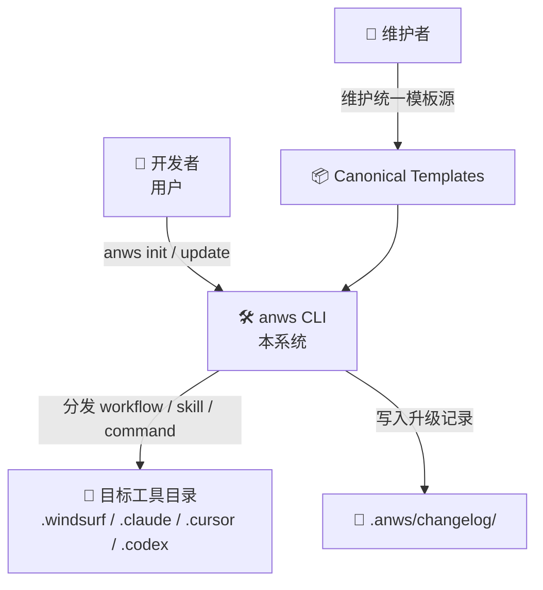
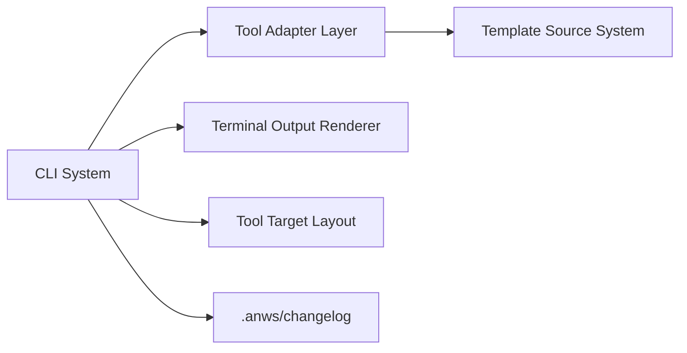
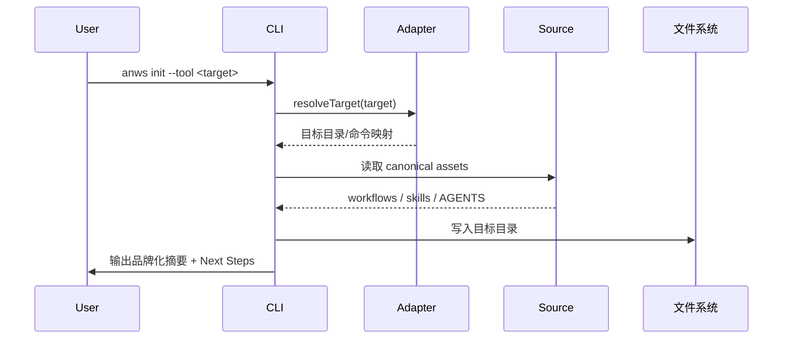
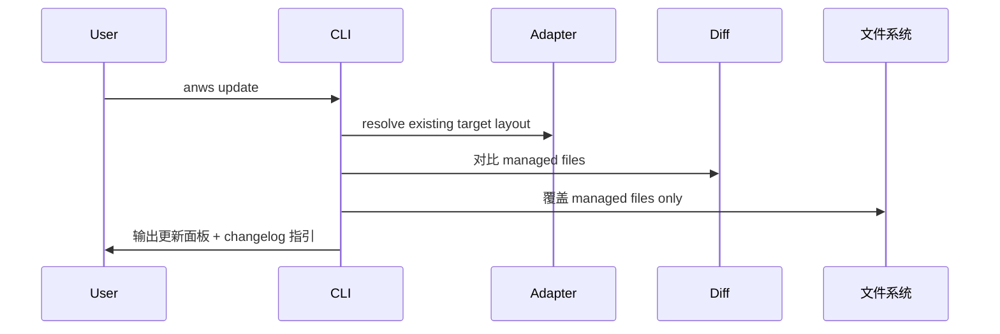
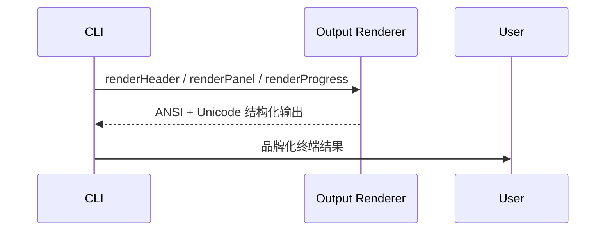

# 系统架构总览 (Architecture Overview)

**项目**: `anws` — 多工具工作流分发 CLI
**版本**: 4.0
**日期**: 2026-03-14
**关联 ADR**: `03_ADR/ADR_001_TECH_STACK.md`, `03_ADR/ADR_003_CHANGELOG_SYSTEM.md`, `03_ADR/ADR_004_MULTI_TOOL_ADAPTERS.md`, `03_ADR/ADR_005_CLI_OUTPUT_EXPERIENCE.md`

---

## 1. 系统上下文 (System Context)

### 1.1 C4 Level 1 — 系统上下文图



### 1.2 关键角色

| 角色 | 描述 | 交互方式 |
|------|------|---------|
| **开发者 (用户)** | 在项目中初始化或升级 `anws` 工作流系统 | 运行 `anws init` / `anws update` |
| **维护者** | 维护统一源模板、适配规则与发布版本 | 更新 `src/anws/templates/` 与适配逻辑 |
| **AI IDE / Agent Tool** | 消费工作流、技能与命令资产的目标环境 | 从目标目录中发现并执行 `anws` 资产 |

### 1.3 外部系统

| 系统 | 类型 | 交互 |
|------|------|------|
| npm Registry | 外部服务 | 分发 `anws` CLI |
| 目标项目文件系统 | 用户本地 | 写入目标工具目录与 `.anws/changelog/` |
| 多 AI 编程工具 | 外部消费方 | 读取 `workflow / skill / command` 资产 |

---

## 2. 系统清单 (System Inventory)

### System 1: CLI System
**系统 ID**: `cli-system`

**职责**:
- 解析命令参数与目标工具上下文
- 协调初始化、更新、预检、changelog 生成
- 渲染终端输出（Header、面板、进度树、警告、Next Steps）
- 保障 managed files 更新边界

**源码根目录**: `src/anws/bin/` + `src/anws/lib/`

---

### System 2: Template Source System
**系统 ID**: `template-source-system`

**职责**:
- 存放 canonical workflows / skills / AGENTS 模板
- 为适配层提供统一源内容
- 作为 managed files 的权威来源

**源码根目录**: `src/anws/templates/`

---

### System 3: Tool Adapter Layer
**系统 ID**: `tool-adapter-layer`

**职责**:
- 将统一源资产映射到具体工具目标目录
- 决定 workflow / skill / command 在目标工具中的落点与命名
- 控制不同工具之间的布局差异，而不破坏统一源

**逻辑位置**: `src/anws/lib/` 中的适配与分发逻辑（v4 建模，待实现）

---

## 3. 系统边界矩阵

| 系统 | 输入 | 输出 | 依赖系统 | 被依赖 |
|------|------|------|---------|--------|
| CLI System | `argv`, `stdin`, 当前 cwd | stdout, 文件写入, changelog | Template Source, Tool Adapter Layer | — |
| Template Source System | 维护者更新模板 | workflow/skill/AGENTS 源内容 | — | CLI, Adapter |
| Tool Adapter Layer | canonical source + target tool | 目标目录布局与映射结果 | Template Source | CLI |

---

## 4. 依赖关系图



---

## 5. 物理代码结构 (Physical Code Structure)

```text
src/
└── anws/
    ├── package.json
    ├── bin/
    │   └── cli.js
    ├── lib/
    │   ├── init.js
    │   ├── update.js
    │   ├── diff.js
    │   ├── changelog.js
    │   ├── manifest.js
    │   ├── adapters/                # v4 新建模：工具适配规则
    │   │   ├── windsurf.js
    │   │   ├── claude-code.js
    │   │   ├── cursor.js
    │   │   └── codex.js
    │   └── output/                  # v4 新建模：终端输出渲染
    │       ├── header.js
    │       ├── panels.js
    │       └── progress.js
    └── templates/
        ├── canonical/               # v4 推荐：统一源模板层
        │   ├── workflows/
        │   ├── skills/
        │   └── AGENTS.md
        └── targets/                 # v4 可选：按目标工具生成后的输出快照/模板
            ├── windsurf/
            ├── claude-code/
            ├── cursor/
            └── codex/
```

> [!WARNING]
> AI 推断填充，请人类复核。
>
> `canonical/` 与 `targets/` 的具体落地目录是 v4 的推荐实现方向，用于表达统一源与目标适配的边界。最终实现时可保留现有目录并在 `lib/` 中完成映射，只要不破坏“一套源、多个目标”的原则即可。

---

## 6. 核心执行流程 (Key Execution Flows)

### Flow A: 多工具初始化



### Flow B: 多工具更新



### Flow C: 终端输出渲染



---

## 7. 关键架构原则

### 7.1 一套源，多目标

统一源模板是核心。目标工具差异必须被限制在 Adapter Layer，而不能蔓延到业务文档与长期维护结构中。

### 7.2 体验也是架构

终端输出不再只是“打印文本”，而是 `anws` 产品体验的一部分。结构、层级、符号系统与下一步引导都属于架构设计范围。

### 7.3 安全优先于便利

无论支持多少工具目标，managed files 边界都必须先于“自动化便利”被定义清楚。

---

## 8. 技术栈总览

| Layer | Technology | 用于 |
|-------|-----------|------|
| CLI Runtime | Node.js ≥ 18 | CLI System |
| 参数解析 | `node:util` parseArgs | 命令与目标工具解析 |
| 交互 Prompt | `node:readline` | 确认与选择 |
| 文件操作 | `node:fs/promises`, `node:path` | 分发、更新、changelog |
| 输出渲染 | 原生 ANSI + Unicode/ASCII | 终端品牌与结构化输出 |
| 适配模型 | JS 规则映射 | 多工具目标分发 |
