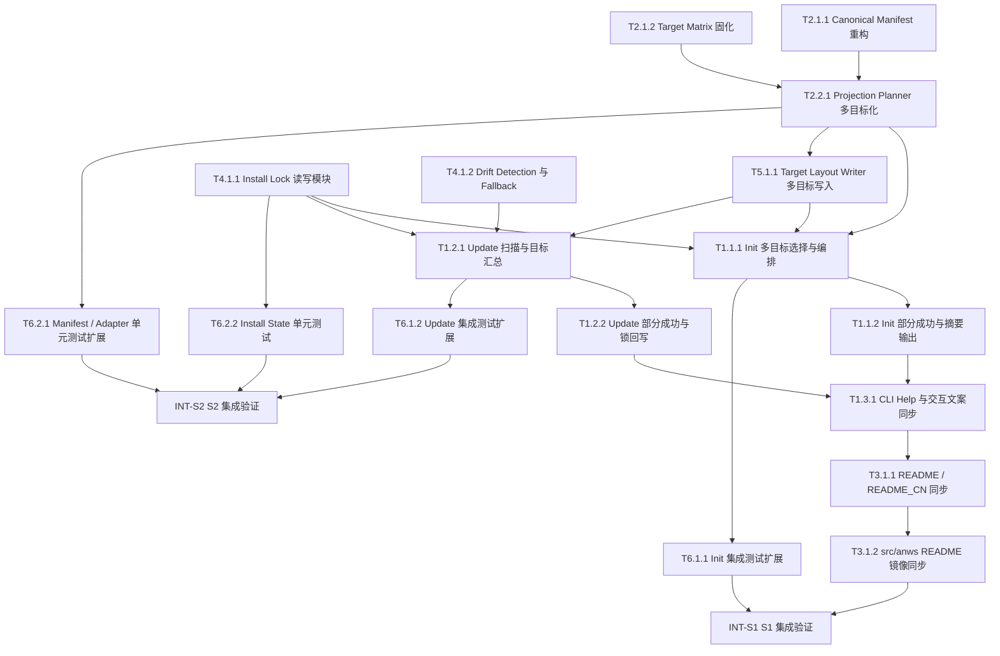

# 任务清单 (Task List) - .anws v6

## 依赖图总览

## 📊 Sprint 路线图

| Sprint | 代号 | 核心任务 | 退出标准 | 预估 |
|--------|------|---------|---------|------|
| S1 | Multi-Target Foundation | canonical manifest、多目标投影规划、install-lock、init 基础编排、文案同步 | `anws init` 可显式安装多个 targets，并生成可解释的 `.anws/install-lock.json`；README/CLI help 与行为一致 | 4-5d |
| S2 | Unified Update | 多目标 update 扫描、部分成功语义、drift fallback、测试闭环 | `anws update` / `anws update --check` 可按 target 分组扫描、预览、更新并正确回写状态；关键测试通过 | 4-5d |

---

## System 1: CLI Orchestrator

### Phase 1: Foundation

- [x] **T1.1.1** [REQ-001]: 重构 `init` 为多目标显式选择与编排入口
  - **描述**: 将 `src/anws/lib/init.js` 从单目标初始化流程重构为支持显式多选 targets 的编排入口，统一消费 projection plan 和 install state，而不是在流程里直接拼接目标逻辑。
  - **输入**: `.anws/v6/01_PRD.md` 的 US01；`.anws/v6/02_ARCHITECTURE_OVERVIEW.md` 的 Flow A；T2.2.1 产出的 projection plan API；T4.1.1 产出的 install-lock 读写 API；T5.1.1 产出的 per-target 写入结果对象。
  - **输出**: 更新后的 `src/anws/lib/init.js`；多目标选择结果到投影执行的编排接口。
  - **验收标准**:
    - Given 空项目与多个受支持 targets
    - When 执行 `anws init`
    - Then CLI 支持一次性显式选择一个或多个 targets
    - Given projection planner 返回多个 target 的计划
    - When `init` 执行写入
    - Then CLI 按 target 顺序调用写入层并汇总结果
    - Given 某个 target 已存在于 lock 中
    - When 再次选择该 target
    - Then 不产生重复安装记录
  - **验证类型**: 集成测试
  - **验证说明**: 运行 init 集成测试并检查多 target 目录、install-lock 与终端摘要是否一致。
  - **估时**: 6h
  - **依赖**: T2.2.1, T4.1.1, T5.1.1

- [x] **T1.1.2** [REQ-001]: 为 `init` 实现部分成功语义与按 target 摘要输出
  - **描述**: 为多目标初始化补齐 per-target 成功/失败收集、终端摘要、next steps 和失败 reporting，确保成功 target 的状态与落盘结果一致，失败 target 不污染状态。
  - **输入**: T1.1.1 产出的多目标 init 编排流程；T4.1.1 的 install-lock 回写接口；T5.1.1 的 per-target 写入结果对象。
  - **输出**: `src/anws/lib/init.js` 中的结果汇总逻辑；按 target 分组的安装摘要输出。
  - **验收标准**:
    - Given 多个 targets 中只有部分写入成功
    - When `init` 结束
    - Then 输出必须逐 target 标记成功和失败
    - Given 存在失败 target
    - When 检查 install-lock
    - Then 只保留成功 target 的最新状态
    - Given 全部 target 成功
    - When `init` 完成
    - Then 输出包含清晰的 next steps 与安装清单
  - **验证类型**: 集成测试
  - **验证说明**: 模拟部分 target 写入失败，确认摘要输出、锁文件内容与实际写入结果一致。
  - **估时**: 4h
  - **依赖**: T1.1.1

### Phase 2: Core

- [x] **T1.2.1** [REQ-004]: 重构 `update` 为多目标扫描、展示与统一更新入口
  - **描述**: 将 `src/anws/lib/update.js` 从单目标上下文升级为读取 install-lock、目录扫描兜底、展示命中 targets 并统一调度更新的编排入口。
  - **输入**: `.anws/v6/01_PRD.md` 的 US04/US05；`.anws/v6/02_ARCHITECTURE_OVERVIEW.md` 的 Flow B；T4.1.1 的 lock 读取 API；T4.1.2 的 drift/fallback 检测 API；T2.2.1 的 projection diff API；T5.1.1 的 per-target 写入器。
  - **输出**: 更新后的 `src/anws/lib/update.js`；按 target 分组的扫描结果与更新调度流程。
  - **验收标准**:
    - Given 项目中存在多个已安装 targets
    - When 执行 `anws update`
    - Then CLI 先展示命中的 target 集合
    - Given 执行 `anws update --check`
    - When 生成差异预览
    - Then 结果必须按 target 分组展示
    - Given lock 缺失但目录存在受管 target
    - When 执行 update
    - Then CLI 进入目录扫描兜底并提示状态重建
  - **验证类型**: 集成测试
  - **验证说明**: 运行 update 集成测试，检查扫描结果、预览输出和命中 target 集合是否符合 lock + scan 语义。
  - **估时**: 6h
  - **依赖**: T2.2.1, T4.1.1, T4.1.2, T5.1.1

- [ ] **T1.2.2** [REQ-004]: 为 `update` 实现部分成功回写与 changelog 汇总
  - **描述**: 为多目标 update 实现 per-target 成功/失败聚合、成功 target 状态回写、失败 target 保留报告以及 changelog/summary 输出。
  - **输入**: T1.2.1 产出的多目标 update 编排流程；T4.1.1 的 lock 回写 API；现有 `.anws/changelog` 输出机制。
  - **输出**: 更新后的 `src/anws/lib/update.js`；按 target 分组的更新摘要与 changelog 写入逻辑。
  - **验收标准**:
    - Given 多 target update 中部分 target 失败
    - When update 完成
    - Then 成功 target 的文件与 lock 状态被回写
    - Given 存在失败 target
    - When 查看终端输出与 changelog
    - Then 失败 target 被单独列出且不会误记为成功
    - Given 执行 `update --check`
    - When 仅做预览
    - Then 不写入 lock 与物理文件
  - **验证类型**: 集成测试
  - **验证说明**: 运行多 target update 场景，确认部分成功时的锁回写、日志与预览模式行为。
  - **估时**: 5h
  - **依赖**: T1.2.1

### Phase 3: Polish

- [ ] **T1.3.1** [REQ-006]: 同步 CLI help、交互提示与错误文案到多目标模型
  - **描述**: 更新 `src/anws/bin/cli.js` 及相关输出模块，让 init/update/help/错误提示完整表达多目标安装、扫描更新、install-lock 和部分成功语义。
  - **输入**: `.anws/v6/01_PRD.md` 的 US06；T1.1.2 的 init 摘要输出；T1.2.2 的 update 摘要输出；现有 `src/anws/lib/output.js`。
  - **输出**: 更新后的 `src/anws/bin/cli.js`；必要时更新 `src/anws/lib/output.js` 中的说明与错误消息。
  - **验收标准**:
    - Given 用户查看 `anws --help`
    - When 阅读 init/update 描述
    - Then 能明确理解多 target 安装与扫描更新语义
    - Given lock 缺失、漂移或部分成功场景
    - When CLI 报错或提示
    - Then 文案清晰说明下一步与 target 范围
    - Given `update --check`
    - When 查看输出
    - Then 能看到按 target 分组的预览语义提示
  - **验证类型**: 手动验证
  - **验证说明**: 人工检查 help 输出与典型错误/摘要文案，确认术语与行为一致。
  - **估时**: 3h
  - **依赖**: T1.1.2, T1.2.2

---

## System 2: Projection Planner

### Phase 1: Foundation

- [x] **T2.1.1** [REQ-002]: 将 `manifest.js` 重构为 target-aware managed projection manifest
  - **描述**: 把固定 `.agents` 常量清单重构为按 target 解析的 managed manifest 入口，确保后续 init/update 只消费 projection manifest，而不是硬编码路径数组。
  - **输入**: `.anws/v6/03_ADR/ADR_006_CANONICAL_RESOURCE_MODEL.md` 的结果约束；现有 `src/anws/lib/manifest.js`；`.anws/v6/02_ARCHITECTURE_OVERVIEW.md` 中 Projection Planner 边界。
  - **输出**: 更新后的 `src/anws/lib/manifest.js`；可按 target 集合生成 managed manifest 的导出函数。
  - **验收标准**:
    - Given 任意受支持 target
    - When 请求 managed manifest
    - Then 返回 target 对应的 projection entries 而不是固定物理路径常量
    - Given 多个 targets
    - When 组合生成 manifest
    - Then 结果可按 target 独立识别 ownership
    - Given 未支持 target
    - When 请求 manifest
    - Then 明确抛出受支持矩阵错误
  - **验证类型**: 单元测试
  - **验证说明**: 运行 manifest 单元测试，确认不同 target 的 entries、ownership 和错误路径正确。
  - **估时**: 4h
  - **依赖**: 无

- [x] **T2.1.2** [REQ-003]: 固化首批 target matrix 与 adapter 契约
  - **描述**: 在 `src/anws/lib/adapters/` 中统一整理首批 6 个 targets 的 layout、projection shape、显示名和 detection metadata，形成单一权威矩阵。
  - **输入**: `.anws/v6/01_PRD.md` 的 Target Matrix；`.anws/v6/02_ARCHITECTURE_OVERVIEW.md` 的目标投影矩阵；ADR-004 的第一批目标定义。
  - **输出**: 更新后的 `src/anws/lib/adapters/index.js`；必要的 per-target adapter 模块定义。
  - **验收标准**:
    - Given 首批 6 个 targets
    - When 查询 adapter registry
    - Then 均返回明确的 layout 与 projection metadata
    - Given 未注册 target
    - When 请求 adapter
    - Then 返回一致的受支持列表错误
    - Given 同一 capability 需要不同资源形态
    - When 查询 target metadata
    - Then 可区分 workflow、command、agent、prompt、skill 等形态
  - **验证类型**: 单元测试
  - **验证说明**: 运行 adapters 单元测试，检查 registry 的完整性、显示名、路径和 detection metadata。
  - **估时**: 4h
  - **依赖**: 无

### Phase 2: Core

- [x] **T2.2.1** [REQ-002]: 实现多目标 projection planner 与 per-target diff 输入
  - **描述**: 构建 projection planner，使其接收 canonical capability + target set，输出 grouped projection plan、per-target ownership 与 diff 输入，供 init/update/check 统一消费。
  - **输入**: T2.1.1 产出的 target-aware managed manifest API；T2.1.2 产出的 target matrix registry；`src/anws/lib/diff.js` 当前接口；`.anws/v6/03_ADR/ADR_006_CANONICAL_RESOURCE_MODEL.md` 的三层模型。
  - **输出**: 更新后的 planner 入口（可位于 `src/anws/lib/manifest.js` 或 adapters 层）；`src/anws/lib/diff.js` 适配多目标 projection entries 的接口。
  - **验收标准**:
    - Given 一组 canonical capabilities 与多个 targets
    - When 生成 projection plan
    - Then 输出按 target 分组且包含路径、资源形态与 ownership 摘要
    - Given `update --check`
    - When 调用 diff 收集
    - Then 能直接消费 per-target projection entries 生成差异
    - Given 某个 target 缺 projection rule
    - When 生成 plan
    - Then 仅拒绝该 target 并给出缺失规则说明
  - **验证类型**: 单元测试
  - **验证说明**: 运行 planner / diff 相关测试，确认多 target 分组、错误场景和 diff 输入契约正确。
  - **估时**: 6h
  - **依赖**: T2.1.1, T2.1.2

---

## System 3: Canonical Resource Source

### Phase 1: Integration

- [ ] **T3.1.1** [REQ-006]: 同步根 README / README_CN 到多目标安装与更新模型
  - **描述**: 更新仓库根 `README.md` 与 `README_CN.md` 的快速开始、兼容性、项目结构、update 说明与 install-lock 语义，确保文档与 v6 行为一致。
  - **输入**: `.anws/v6/01_PRD.md` 的 US06；T1.3.1 产出的 CLI help 文案；T2.1.2 的 target matrix 定义。
  - **输出**: 更新后的 `README.md` 与 `README_CN.md`。
  - **验收标准**:
    - Given 用户阅读安装章节
    - When 查看 init 示例
    - Then 能理解显式多 target 安装流程
    - Given 用户阅读 update 章节
    - When 查看状态说明
    - Then 能理解 lock 优先、扫描兜底和部分成功语义
    - Given 用户查看项目结构示例
    - When 核对目录树
    - Then 不会误解为共享物理文件
  - **验证类型**: 手动验证
  - **验证说明**: 人工通读 README / README_CN，确认命令示例、目录树和术语与 CLI 一致。
  - **估时**: 3h
  - **依赖**: T1.3.1

- [ ] **T3.1.2** [REQ-006]: 同步 `src/anws/README*.md` 镜像文档
  - **描述**: 将根 README 的多目标语义同步到 `src/anws/README.md` 与 `src/anws/README_CN.md`，避免发布包文档与仓库文档分叉。
  - **输入**: T3.1.1 产出的 README / README_CN 更新内容。
  - **输出**: 更新后的 `src/anws/README.md` 与 `src/anws/README_CN.md`。
  - **验收标准**:
    - Given 根 README 已完成更新
    - When 检查 `src/anws/README*.md`
    - Then 核心安装、更新、状态模型与目录结构叙述保持一致
    - Given 任一文档中的命令示例
    - When 对比 CLI 行为
    - Then 不存在语义分叉
    - Given 发布包文档被单独阅读
    - When 用户查找 update 说明
    - Then 能获得完整的多目标语义说明
  - **验证类型**: 手动验证
  - **验证说明**: 对照根 README 与 `src/anws/README*.md`，确认章节和术语同步。
  - **估时**: 2h
  - **依赖**: T3.1.1

---

## System 4: Install State Registry

### Phase 1: Foundation

- [x] **T4.1.1** [REQ-005]: 实现 `.anws/install-lock.json` 读写与 schema 约束
  - **描述**: 创建 `src/anws/lib/install-state.js`（或等效模块），定义 install-lock schema、读写、去重、版本记录与 per-target ownership 摘要接口。
  - **输入**: `.anws/v6/03_ADR/ADR_007_INSTALL_STATE_AND_UPDATE_ORCHESTRATION.md` 的决策与约束；`.anws/v6/02_ARCHITECTURE_OVERVIEW.md` 中 Install State Registry 职责。
  - **输出**: `src/anws/lib/install-state.js`；lock schema 辅助函数；供 init/update 调用的 state API。
  - **验收标准**:
    - Given 一组已安装 targets 与 ownership 摘要
    - When 写入 install-lock
    - Then 文件包含版本、targets、per-target managed summary 和最近结果信息
    - Given 同一 target 被重复写入
    - When 更新 lock
    - Then 不会产生重复条目
    - Given lock 文件损坏或字段缺失
    - When 读取 state
    - Then 返回可识别错误并支持 fallback 分支继续处理
  - **验证类型**: 单元测试
  - **验证说明**: 运行 install-state 单元测试，确认读写、去重、损坏文件处理和 schema 校验逻辑。
  - **估时**: 5h
  - **依赖**: 无

- [x] **T4.1.2** [REQ-005]: 实现 lock 漂移检测与目录扫描 fallback
  - **描述**: 基于 adapter registry 和文件系统扫描实现 lock drift detection、缺失恢复提示与 fallback target detection，供 update 在 lock 缺失或漂移时兜底使用。
  - **输入**: T4.1.1 产出的 state API；T2.1.2 产出的 target detection metadata；现有 `src/anws/lib/adapters/index.js` 检测能力。
  - **输出**: `src/anws/lib/install-state.js` 或 adapters 层中的 drift/fallback API；update 可消费的 target scan result 数据结构。
  - **验收标准**:
    - Given lock 文件缺失但目录中存在受支持 target
    - When 触发 fallback 扫描
    - Then 返回命中的 target 集合与重建提示
    - Given lock 中声明的 target 与真实目录不一致
    - When 扫描 drift
    - Then 返回清晰的漂移报告
    - Given 没有任何已安装 target
    - When 执行扫描
    - Then 返回空结果与可解释提示
  - **验证类型**: 集成测试
  - **验证说明**: 构造 lock 缺失、目录删除、目录新增等场景，确认扫描结果与 drift 提示正确。
  - **估时**: 4h
  - **依赖**: T4.1.1, T2.1.2

---

## System 5: Target Layout Writer

### Phase 1: Core

- [x] **T5.1.1** [REQ-001]: 实现 per-target 文件写入器与独立 ownership 边界
  - **描述**: 将 `src/anws/lib/copy.js`、`src/anws/lib/init.js`、`src/anws/lib/update.js` 中的实际写入能力收口为 per-target writer，确保不同 target 的文件创建、覆盖和保护规则彼此独立。
  - **输入**: T2.2.1 产出的 grouped projection plan；现有 `src/anws/lib/copy.js`；`.anws/v6/02_ARCHITECTURE_OVERVIEW.md` 中 Target Layout Writer 边界。
  - **输出**: 更新后的 `src/anws/lib/copy.js`；per-target 写入结果对象；受管/非受管边界的统一处理逻辑。
  - **验收标准**:
    - Given 多个 target 的 projection plan
    - When 执行写入
    - Then 每个 target 仅写入自己的目标目录与文件
    - Given 某 target 存在用户自定义非托管文件
    - When 执行写入或更新
    - Then 不会越权覆盖非托管内容
    - Given Antigravity target
    - When 执行相关写入
    - Then 保持 `AGENTS.md` 兼容与既有保护规则
  - **验证类型**: 集成测试
  - **验证说明**: 运行写入路径相关测试，检查多 target 并存时的目录归属、文件保护和 legacy 兼容行为。
  - **估时**: 5h
  - **依赖**: T2.2.1

---

## System 6: Verification & Quality Gates

### Phase 1: Integration

- [x] **T6.1.1** [REQ-001]: 扩展 `init` 集成测试覆盖多目标安装与去重
  - **描述**: 扩展 `src/anws/test/init.integration.test.js`，覆盖空项目多目标安装、重复 target 选择、部分成功与 install-lock 生成场景。
  - **输入**: T1.1.2 产出的多目标 init 行为；T4.1.1 的 install-lock schema；现有 `src/anws/test/init.integration.test.js`。
  - **输出**: 更新后的 `src/anws/test/init.integration.test.js`。
  - **验收标准**:
    - Given 多目标 init 场景
    - When 运行集成测试
    - Then 覆盖至少一个成功路径和一个部分成功路径
    - Given 重复选择已安装 target
    - When 运行测试
    - Then 验证不会产生重复 lock 记录
    - Given 生成 install-lock
    - When 断言结果
    - Then 内容与实际写入 targets 一致
  - **验证类型**: 集成测试
  - **验证说明**: 运行 init 集成测试套件，确认通过且断言覆盖多目标与状态文件语义。
  - **估时**: 3h
  - **依赖**: T1.1.1, T1.1.2

- [ ] **T6.1.2** [REQ-004]: 扩展 `update` 集成测试覆盖扫描、check 与部分成功
  - **描述**: 扩展 `src/anws/test/update.integration.test.js`，覆盖 lock 驱动扫描、目录扫描 fallback、`update --check` 按 target 分组展示以及部分成功回写行为。
  - **输入**: T1.2.2 产出的多目标 update 行为；T4.1.2 的 fallback API；现有 `src/anws/test/update.integration.test.js`。
  - **输出**: 更新后的 `src/anws/test/update.integration.test.js`。
  - **验收标准**:
    - Given 多 target update 场景
    - When 运行集成测试
    - Then 覆盖 lock 正常、lock 缺失 fallback 和部分成功三类路径
    - Given `update --check`
    - When 检查输出断言
    - Then 差异预览按 target 分组
    - Given 某 target 更新失败
    - When 断言 lock 回写
    - Then 仅成功 target 被标记为最新状态
  - **验证类型**: 集成测试
  - **验证说明**: 运行 update 集成测试套件，检查多条路径全部通过并产生正确断言。
  - **估时**: 4h
  - **依赖**: T1.2.1, T1.2.2, T4.1.2

### Phase 2: Polish

- [ ] **T6.2.1** [REQ-003]: 扩展 manifest / adapter 单元测试覆盖目标矩阵
  - **描述**: 扩展 `src/anws/test/manifest.test.js` 与 `src/anws/test/adapters.test.js`，验证 6 个 targets 的 projection shape、layout、detection 与错误提示一致。
  - **输入**: T2.1.1 产出的 target-aware manifest API；T2.1.2 产出的 target registry；现有 `src/anws/test/manifest.test.js` 与 `src/anws/test/adapters.test.js`。
  - **输出**: 更新后的 `src/anws/test/manifest.test.js`；更新后的 `src/anws/test/adapters.test.js`。
  - **验收标准**:
    - Given 首批 6 个 targets
    - When 运行单元测试
    - Then 每个 target 的 layout 与 projection metadata 都有断言覆盖
    - Given 不支持的 target
    - When 运行错误路径测试
    - Then 返回稳定的支持列表错误
    - Given adapter 检测元数据
    - When 运行检测测试
    - Then 能区分 lock 驱动与目录驱动的识别结果
  - **验证类型**: 单元测试
  - **验证说明**: 运行 manifest / adapters 单元测试，确认全部通过且覆盖矩阵完整性。
  - **估时**: 3h
  - **依赖**: T2.2.1

- [ ] **T6.2.2** [REQ-005]: 新增 install-state 单元测试覆盖 schema、去重与漂移路径
  - **描述**: 为 `src/anws/lib/install-state.js` 增加独立单元测试，验证 lock schema、损坏容错、target 去重和 drift 检测结果结构。
  - **输入**: T4.1.1 产出的 install-state 模块；T4.1.2 产出的 drift/fallback API。
  - **输出**: 新增 `src/anws/test/install-state.test.js`。
  - **验收标准**:
    - Given 正常 lock 数据
    - When 运行单元测试
    - Then schema 校验和读写断言通过
    - Given 重复 target 与损坏 lock 文件
    - When 运行测试
    - Then 返回稳定的去重或错误结果
    - Given drift/fallback 场景
    - When 运行测试
    - Then 输出结构能被 update 编排稳定消费
  - **验证类型**: 单元测试
  - **验证说明**: 运行 install-state 单元测试，确认读写、损坏、去重和 drift 路径全部通过。
  - **估时**: 3h
  - **依赖**: T4.1.1, T4.1.2

---

## 集成验证任务 (INT)

- [ ] **INT-S1** [MILESTONE]: S1 集成验证 — Multi-Target Foundation
  - **描述**: 验证 S1 的退出标准，确认多目标 init、projection planner、install-lock 与文案同步已经形成可演示闭环。
  - **输入**: T1.1.1、T1.1.2、T1.3.1、T2.1.1、T2.1.2、T2.2.1、T3.1.1、T3.1.2、T4.1.1、T5.1.1、T6.1.1 的产出。
  - **输出**: S1 集成验证报告（通过/失败 + 问题清单）。
  - **验收标准**:
    - Given S1 所有任务已完成
    - When 在空项目中执行多目标 `anws init`
    - Then 至少两个 targets 安装成功且 `.anws/install-lock.json` 正确生成
    - Given 用户查看 CLI help 与 README
    - When 对照安装/更新说明
    - Then 术语与行为完全一致
  - **验证类型**: 集成测试
  - **验证说明**: 按退出标准逐条执行 init 演示、help 检查和文档核对，记录日志与结果。
  - **估时**: 3h
  - **依赖**: T3.1.2, T6.1.1

- [ ] **INT-S2** [MILESTONE]: S2 集成验证 — Unified Update
  - **描述**: 验证 S2 的退出标准，确认多目标 update、`--check`、drift fallback、部分成功和状态回写形成完整闭环。
  - **输入**: T1.2.1、T1.2.2、T4.1.2、T6.1.2、T6.2.1、T6.2.2 的产出。
  - **输出**: S2 集成验证报告（通过/失败 + 问题清单）。
  - **验收标准**:
    - Given S2 所有任务已完成
    - When 执行 `anws update --check` 与 `anws update`
    - Then 结果按 target 分组展示且更新范围正确
    - Given 存在 lock 漂移与部分 target 失败场景
    - When 执行 update
    - Then 成功 target 保留结果、失败 target 明确报告且 lock 只回写成功状态
  - **验证类型**: 集成测试
  - **验证说明**: 按退出标准逐条执行 update/check、drift 和部分成功场景，保留日志或测试报告。
  - **估时**: 3h
  - **依赖**: T6.1.2, T6.2.1, T6.2.2

---

## 🎯 User Story Overlay

### US01: 多目标 IDE 初始化 [REQ-001] (P0)
**涉及任务**: T2.1.1 → T2.1.2 → T2.2.1 → T4.1.1 → T5.1.1 → T1.1.1 → T1.1.2 → T6.1.1
**关键路径**: T2.1.1 → T2.2.1 → T4.1.1 → T5.1.1 → T1.1.1 → T1.1.2 → T6.1.1
**独立可测**: ✅ S1 结束即可演示
**覆盖状态**: ✅ 完整

### US02: 统一源资源投影 [REQ-002] (P0)
**涉及任务**: T2.1.1 → T2.2.1
**关键路径**: T2.1.1 → T2.2.1
**独立可测**: ✅ S1 中段即可验证 planner 输出
**覆盖状态**: ✅ 完整

### US03: 目标适配矩阵 [REQ-003] (P0)
**涉及任务**: T2.1.2 → T2.2.1 → T6.2.1
**关键路径**: T2.1.2 → T2.2.1 → T6.2.1
**独立可测**: ✅ S2 前半段可通过单元测试验证
**覆盖状态**: ✅ 完整

### US04: 多目标扫描更新 [REQ-004] (P0)
**涉及任务**: T4.1.1 → T4.1.2 → T2.2.1 → T5.1.1 → T1.2.1 → T1.2.2 → T6.1.2 → INT-S2
**关键路径**: T4.1.1 → T4.1.2 → T1.2.1 → T1.2.2 → T6.1.2 → INT-S2
**独立可测**: ✅ S2 结束可完整演示
**覆盖状态**: ✅ 完整

### US05: 安装状态权威记录 [REQ-005] (P0)
**涉及任务**: T4.1.1 → T4.1.2 → T6.2.2 → T1.2.1
**关键路径**: T4.1.1 → T4.1.2 → T6.2.2
**独立可测**: ✅ S1 可验证写入，S2 可验证 drift 与 fallback
**覆盖状态**: ✅ 完整

### US06: 文案与帮助一致性 [REQ-006] (P1)
**涉及任务**: T1.3.1 → T3.1.1 → T3.1.2 → INT-S1
**关键路径**: T1.3.1 → T3.1.1 → T3.1.2
**独立可测**: ✅ S1 结束即可人工检查
**覆盖状态**: ✅ 完整

---

## 覆盖性结论

- **P0 用户故事前置**: US01、US02、US03、US05 被安排在 S1 或 S2 前半段，满足优先落地原则。
- **跨系统闭环**: `init` 闭环在 S1 完成，`update` 闭环在 S2 完成。
- **当前风险**: 因 `04_SYSTEM_DESIGN/` 缺失，`install-state` schema 与 per-target writer 的接口粒度仍偏架构级；执行前建议在实现波次补最小设计草图或接口说明。
