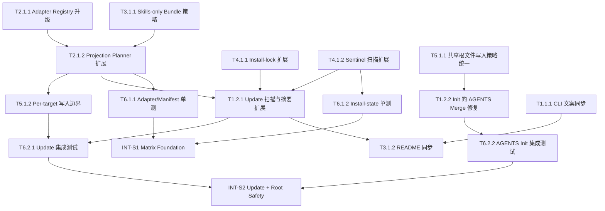

# 任务清单 (Task List) - .anws v7

## 依赖图总览

## 📊 Sprint 路线图

| Sprint | 代号 | 核心任务 | 退出标准 | 预估 |
|--------|------|---------|---------|------|
| S1 | Matrix Foundation | adapter registry、projection planner、skills-only bundle、install-lock/sentinel 扩展、基础单测 | v7 全量 target matrix 在 adapter / manifest / install-state 中可表达、可扫描、可测试 | 3-4d |
| S2 | Safe Update & Init | update/check 摘要、per-target 写入边界、AGENTS merge 修复、集成测试 | `update` / `update --check` 与 `init` 在新矩阵和 AGENTS 安全语义下行为正确 | 3-4d |
| S3 | Docs & Finish | CLI help、README、发布前一致性检查 | 文档、CLI、测试与 v7 真理完全一致，可进入持续实施 | 1-2d |

## 🌊 Forge 波次建议

- **Wave 1**
  - `T2.1.1`
  - `T3.1.1`
  - `T2.1.2`
  - `T4.1.1`
  - `T4.1.2`
- **Wave 2**
  - `T5.1.1`
  - `T1.2.2`
  - `T5.1.2`
  - `T1.2.1`
- **Wave 3**
  - `T6.1.1`
  - `T6.1.2`
  - `T6.2.1`
  - `T6.2.2`
  - `T1.1.1`
  - `T3.1.2`

---

## System 1: CLI Orchestrator

### Phase 1: Foundation

- [x] **T1.1.1** [REQ-006]: 同步 CLI 对 v7 目标矩阵的帮助文案与展示名称
  - **描述**: 更新 `src/anws/bin/cli.js` 与相关输出模块，使 `Copilot / Codex / OpenCode / Trae / Qoder / Kilo Code` 的显示名、说明、示例命令和支持矩阵与 v7 一致。
  - **输入**: `.anws/v7/01_PRD.md` 的 US06；`.anws/v7/02_ARCHITECTURE_OVERVIEW.md` 的目标投影矩阵；`src/anws/bin/cli.js` 当前帮助输出。
  - **输出**: 更新后的 `src/anws/bin/cli.js`；必要时同步 `src/anws/lib/output.js`。
  - **验收标准**:
    - Given 用户查看 `anws --help`
    - When 阅读支持列表与 init / update 说明
    - Then 能看到 v7 中定义的完整目标矩阵
  - **验证类型**: 手动验证
  - **估时**: 2h
  - **依赖**: T1.2.1

### Phase 2: Core

- [x] **T1.2.1** [REQ-004]: 扩展 `update` 扫描、预览与摘要输出以覆盖 v7 目标矩阵
  - **描述**: 调整 `src/anws/lib/update.js` 的目标展示、预览、summary 与失败报告，使其覆盖 `Trae / Qoder / Kilo Code`，并与新的 sentinel / lock 语义一致；当状态来自 fallback 扫描时，需明确展示状态来源，并与 lock 重建策略衔接。
  - **输入**: T2.1.2 的 projection plan；T4.1.1 的 lock 结构；T4.1.2 的 sentinel 扫描结果。
  - **输出**: 更新后的 `src/anws/lib/update.js`；必要时同步 diff 预览输出。
  - **验收标准**:
    - Given 项目中存在多个 v7 targets
    - When 执行 `anws update` 或 `anws update --check`
    - Then 输出按 target 分组展示，且命中集合与 scan + lock 语义一致
    - Given lock 缺失或损坏
    - When 执行 update
    - Then CLI 能通过 sentinel 扫描兜底并明确提示状态来源
    - Given lock 缺失或损坏且目录扫描已识别 targets
    - When 用户执行实际 update 流程
    - Then CLI 必须重建 `.anws/install-lock.json` 或明确报告为何本轮不重建
  - **验证类型**: 集成测试
  - **估时**: 5h
  - **依赖**: T2.1.2, T4.1.1, T4.1.2

- [ ] **T1.2.2** [REQ-001]: 修复 `init` 对根目录 `AGENTS.md` 的整文件覆盖问题
  - **描述**: 让 `src/anws/lib/init.js` 在写入根目录 `AGENTS.md` 时复用与 `update` 一致的 merge / preserve 语义，禁止整文件覆盖导致 AUTO 区块丢失；同时在再次执行 `init` 时复用已有安装状态，使已安装 target 在选择器中被自动标注且不可取消，用户仅能额外新增 target。
  - **输入**: `src/anws/lib/agents.js` 现有 merge 逻辑；T5.1.1 的共享根文件写入策略。
  - **输出**: 更新后的 `src/anws/lib/init.js`。
  - **验收标准**:
    - Given 项目根目录已存在 `AGENTS.md`
    - When 用户再次执行 `anws init`
    - Then 不得发生整文件覆盖
    - Given 项目中已存在通过 `init` 安装过的 targets
    - When 用户再次执行 `anws init`
    - Then 已安装 target 必须自动保留在最终选择集合中，且不可通过交互取消
    - Given 现有 `AGENTS.md` 包含 AUTO 区块
    - When `init` 执行
    - Then AUTO 区块内容必须被保留或按模板规则合并
    - **异常处理**: 当现有 `AGENTS.md` 不含 AUTO 标记且不匹配已识别模板时，CLI 必须提示并拒绝粗暴覆盖
  - **验证类型**: 集成测试
  - **估时**: 4h
  - **依赖**: T5.1.1

---

## System 2: Projection Planner

### Phase 1: Foundation

- [ ] **T2.1.1** [REQ-003]: 将 adapter registry 升级到 v7 目标矩阵
  - **描述**: 更新 `src/anws/lib/adapters/index.js`，正式纳入 `OpenCode / Trae / Qoder / Kilo Code`，并修正 `Copilot / Codex` 的 projectionTypes、layout、display label 与 detect metadata。
  - **输入**: `.anws/v7/01_PRD.md` 的 Target Matrix；`.anws/v7/02_ARCHITECTURE_OVERVIEW.md` 的 sentinel model；`note.txt` 中的 Trae / Kilo 线索。
  - **输出**: 更新后的 `src/anws/lib/adapters/index.js`。
  - **验收标准**:
    - Given 所有 v7 targets
    - When 查询 adapter registry
    - Then 返回与 v7 文档一致的路径、形态和 sentinel 元数据
    - Given 未支持 target
    - When 请求 adapter
    - Then 返回稳定的支持列表错误
  - **验证类型**: 单元测试
  - **估时**: 4h
  - **依赖**: 无

- [ ] **T2.1.2** [REQ-002]: 更新 `manifest.js` 的投影规则以支持 v7 target family
  - **描述**: 扩展 `src/anws/lib/manifest.js`，让 `workflow + skill`、`command + skill`、`prompts + skills`、`skills-only bundle` 四类投影规则都可统一表达，其中 `skills-only bundle` 采用 `anws-system/SKILL.md` 导航壳 + `references/*.md` 的结构。
  - **输入**: T2.1.1 的 adapter matrix；T3.1.1 的 bundle 规则；现有 `RESOURCE_REGISTRY`。
  - **输出**: 更新后的 `src/anws/lib/manifest.js`。
  - **验收标准**:
    - Given `Copilot`
    - When 生成 projection entries
    - Then 输出 `.github/prompts/*` 与 `.github/skills/*`
    - Given `Codex / Trae`
    - When 生成 projection entries
    - Then workflow 被折叠为 `anws-system/SKILL.md` 导航壳 + `references/*.md` 并落到对应 skill 目录
    - Given `Qoder`
    - When 生成 projection entries
    - Then 输出 `.qoder/commands/*` 与 `.qoder/skills/*`
    - Given `Kilo Code`
    - When 生成 projection entries
    - Then 输出 `.kilocode/workflows/*` 与 `.kilocode/skills/*`
  - **验证类型**: 单元测试
  - **估时**: 6h
  - **依赖**: T2.1.1, T3.1.1

---

## System 3: Canonical Resource Source

### Phase 1: Core

- [ ] **T3.1.1** [REQ-002]: 设计并实现 Codex / Trae 的 skills-only bundle 规则
  - **描述**: 为 `Codex` 与 `Trae` 定义统一的 workflow 折叠策略，使用 `anws-system/SKILL.md` 作为导航壳，workflow 明细落在 `references/*.md`，并保留 Trae 对 `SKILL.md` frontmatter 与触发语义的差异空间。
  - **输入**: `note.txt` 中的 Trae 技能结构；当前 Codex 的 `anws-system` bundle 规则。
  - **输出**: v7 可执行的 bundle 规则说明；必要时对应到 `manifest.js` 的命名约定。
  - **验收标准**:
    - Given `Codex`
    - When 投影 workflow
    - Then 生成 `anws-system/SKILL.md` 作为技能入口壳，并将 workflow 明细投到 `references/*.md`
    - Given `Trae`
    - When 投影 workflow
    - Then 使用同类 bundle 策略，但输出结构可承载 Trae 所需 metadata
  - **验证类型**: 单元测试
  - **估时**: 3h
  - **依赖**: 无

- [x] **T3.1.2** [REQ-006]: 同步 README / README_CN / `src/anws/README*.md` 到 v7 矩阵
  - **描述**: 更新文档中的目录树、目标矩阵、update 说明、lock 说明和 `AGENTS.md` 安全语义，并明确 `skills-only` 目标的 `anws-system/SKILL.md + references/*.md` 结构。
  - **输入**: T1.1.1 的 CLI 文案；T1.2.1 的 update 行为；T1.2.2 的 AGENTS 保留语义。
  - **输出**: 更新后的仓库文档与包内镜像文档。
  - **验收标准**:
    - Given 用户阅读 README
    - When 查看目标矩阵与 update 章节
    - Then 文案与 v7 文档、CLI 行为一致
  - **验证类型**: 手动验证
  - **估时**: 3h
  - **依赖**: T1.1.1, T1.2.1, T1.2.2

---

## System 4: Install State Registry

### Phase 1: Foundation

- [x] **T4.1.1** [REQ-005]: 扩展 install-lock schema 与 state summary 到 v7 目标矩阵
  - **描述**: 确认 `src/anws/lib/install-state.js` 能稳定记录新增 targets 的 `managedFiles`、`ownership`、`installedVersion` 与 `lastUpdateSummary`，并为 fallback 扫描后的 lock 重建以及重复 `init` 场景下的状态保留提供一致状态模型。
  - **输入**: T2.1.2 的 projection outputs；现有 install-lock schema。
  - **输出**: 更新后的 `src/anws/lib/install-state.js`。
  - **验收标准**:
    - Given 新老 targets 并存
    - When 写入 `.anws/install-lock.json`
    - Then lock 中的 target 列表、ownership 与 managedFiles 不重复且可解释
    - Given 项目中已有通过 `init` 安装的 targets 且用户在再次 `init` 时新增更多 targets
    - When 初始化完成并写入 `.anws/install-lock.json`
    - Then lock 必须保留既有 targets，并吸收本次新增成功 targets，不得因交互选择丢失历史安装状态
    - Given lock 缺失或损坏但目录扫描已识别 targets
    - When update 进入实际执行路径
    - Then 重建后的 lock 结构仍满足同样的去重与可解释性要求
  - **验证类型**: 单元测试
  - **估时**: 3h
  - **依赖**: T2.1.2

- [ ] **T4.1.2** [REQ-004]: 扩展 sentinel 扫描与 drift 检测到 Trae / Qoder / Kilo Code
  - **描述**: 让 fallback 扫描逻辑能识别 `.trae/skills/anws-system/SKILL.md`、`.qoder/commands/genesis.md`、`.kilocode/workflows/genesis.md` 等新 sentinel。
  - **输入**: T2.1.1 的 detection metadata；现有 `detectInstalledTargets()` 行为。
  - **输出**: 更新后的 `src/anws/lib/adapters/index.js` / `install-state.js` 扫描协作逻辑。
  - **验收标准**:
    - Given lock 缺失或损坏
    - When 执行扫描 fallback
    - Then 能识别所有 v7 targets
    - Given lock 与真实目录漂移
    - When 扫描 drift
    - Then 报告必须包含新增 targets
  - **验证类型**: 单元测试
  - **估时**: 3h
  - **依赖**: T2.1.1

---

## System 5: Target Layout Writer

### Phase 1: Core

- [ ] **T5.1.1** [REQ-001]: 统一 `init` / `update` 的共享根文件写入策略
  - **描述**: 更新 `src/anws/lib/copy.js` 与相关调用方，使 `AGENTS.md` 在 `init` / `update` 中采用一致的 merge / preserve 语义，而不是分别走不同路径；同时让 `init` 在进入写入前复用共享安装状态判断，避免忽略已安装 target 并产生与 lock 脱节的交互选择。
  - **输入**: `src/anws/lib/agents.js` 的 merge 逻辑；`src/anws/lib/copy.js` 当前写入链路。
  - **输出**: 更新后的 `src/anws/lib/copy.js`；必要时扩展 `agents.js` 导出能力。
  - **验收标准**:
    - Given `init` 与 `update` 都可能触达 `AGENTS.md`
    - When 执行写入
    - Then 两者都复用同一套共享根文件策略
    - Given 项目中已存在 install state
    - When 再次执行 `init`
    - Then `init` 的目标选择阶段必须消费该状态并与最终写入结果保持一致
    - Given 目标项目已有自定义 `AGENTS.md`
    - When 执行写入
    - Then 不得无提示地整文件覆盖
  - **验证类型**: 集成测试
  - **估时**: 4h
  - **依赖**: 无

- [ ] **T5.1.2** [REQ-003]: 为新 target 布局实现 per-target 独立写入边界
  - **描述**: 保证 `Trae / Qoder / Kilo Code` 的目录写入、覆盖与保护规则彼此独立，不会误投放到其他 target 目录。
  - **输入**: T2.1.2 的 projection entries；现有 `writeTargetFiles()` 实现。
  - **输出**: 更新后的 `src/anws/lib/copy.js` 与相关调用链。
  - **验收标准**:
    - Given 多个 v7 targets 并存
    - When 执行 `init` / `update`
    - Then 每个 target 仅写入自己的目录结构和文件集合
  - **验证类型**: 集成测试
  - **估时**: 4h
  - **依赖**: T2.1.2

---

## System 6: Verification & Quality Gates

### Phase 1: Unit Coverage

- [ ] **T6.1.1** [REQ-003]: 扩展 adapter / manifest 单元测试覆盖 v7 目标矩阵
  - **描述**: 更新 `src/anws/test/adapters.test.js` 与 `src/anws/test/manifest.test.js`，覆盖 `Copilot / Codex / OpenCode / Trae / Qoder / Kilo Code`。
  - **输入**: T2.1.1、T2.1.2 的实现产物。
  - **输出**: 更新后的 adapter / manifest 单测。
  - **验收标准**:
    - Given v7 全量 targets
    - When 运行单元测试
    - Then 每个 target 的 layout、projectionTypes、detect sentinel 均有断言覆盖
  - **验证类型**: 单元测试
  - **估时**: 3h
  - **依赖**: T2.1.1, T2.1.2

- [x] **T6.1.2** [REQ-005]: 扩展 install-state 单元测试覆盖新 sentinel 与 drift 路径
  - **描述**: 更新 `src/anws/test/install-state.test.js`，覆盖新增 targets 的 fallback 扫描、lock 去重与 drift 检测。
  - **输入**: T4.1.1、T4.1.2 的实现产物。
  - **输出**: 更新后的 install-state 单测。
  - **验收标准**:
    - Given lock 缺失、损坏、漂移场景
    - When 运行测试
    - Then v7 全量 targets 的结果结构都能被 update 编排稳定消费
  - **验证类型**: 单元测试
  - **估时**: 3h
  - **依赖**: T4.1.1, T4.1.2

### Phase 2: Integration Coverage

- [x] **T6.2.1** [REQ-004]: 扩展 `update` 集成测试覆盖 v7 目标矩阵
  - **描述**: 更新 `src/anws/test/update.integration.test.js`，验证 `--check`、部分成功、lock fallback、新 sentinel，以及 fallback 后的 lock 重建语义。
  - **输入**: T1.2.1、T5.1.2 的实现产物。
  - **输出**: 更新后的 update 集成测试。
  - **验收标准**:
    - Given 多个 v7 targets 并存
    - When 执行 `update` / `update --check`
    - Then 结果按 target 分组展示且更新范围正确
    - Given lock 缺失但目录结构完整
    - When 执行实际 `update`
    - Then CLI 必须覆盖 lock 重建路径或明确验证当前不重建的既定语义
  - **验证类型**: 集成测试
  - **估时**: 4h
  - **依赖**: T1.2.1, T5.1.2

- [ ] **T6.2.2** [REQ-001]: 新增 `AGENTS.md` init 保留语义集成测试
  - **描述**: 为 `src/anws/test/init.integration.test.js` 增加已有根 `AGENTS.md` 与重复 `init` 场景，验证 AUTO 区块不会在 `init` 中丢失，且已安装 target 会被锁定保留、用户仍可新增 target。
  - **输入**: T1.2.2 的实现产物。
  - **输出**: 更新后的 init 集成测试。
  - **验收标准**:
    - Given 项目中已有包含 AUTO 区块的 `AGENTS.md`
    - When 再次执行 `anws init`
    - Then AUTO 区块仍存在，且根文件未被不可解释地整文件替换
    - Given 项目中已安装 `A` target
    - When 用户再次执行 `anws init` 并新增选择 `B` target
    - Then 结果必须同时保留 `A` 并安装 `B`，且 `.anws/install-lock.json` 与最终落盘状态一致
  - **验证类型**: 集成测试
  - **估时**: 3h
  - **依赖**: T1.2.2

---

## 集成验证任务 (INT)

- [ ] **INT-S1** [MILESTONE]: S1 集成验证 — Matrix Foundation
  - **描述**: 验证 v7 全量目标矩阵在 adapter、manifest、install-lock、sentinel 扫描上已经形成闭环。
  - **验收标准**:
    - Given `Trae / Qoder / Kilo Code` 被纳入 matrix
    - When 运行相关单测
    - Then 路径、投影、sentinel 与 lock 语义全部一致
  - **依赖**: T6.1.1, T6.1.2

- [ ] **INT-S2** [MILESTONE]: S2 集成验证 — Update + Root Safety
  - **描述**: 验证 `update` / `update --check` 与 `init` 下的 `AGENTS.md` 安全语义、重复 `init` 的 target 保留语义在 v7 中成立。
  - **验收标准**:
    - Given 多目标项目与已有根 `AGENTS.md`
    - When 执行 `init` / `update`
    - Then target 扫描、更新范围、重复 `init` 的 target 保留行为与 AGENTS 保留语义全部正确
  - **依赖**: T6.2.1, T6.2.2

---

## 🎯 User Story Overlay

### US01: 多目标 IDE 初始化 [REQ-001] (P0)
**涉及任务**: T5.1.1 → T1.2.2 → T6.2.2  
**关键路径**: T5.1.1 → T1.2.2 → T6.2.2  
**核心风险**: 根目录 `AGENTS.md` 被整文件覆盖

### US02: 统一源资源投影 [REQ-002] (P0)
**涉及任务**: T3.1.1 → T2.1.2  
**关键路径**: T3.1.1 → T2.1.2  
**核心风险**: skills-only bundle 规则无法统一表达

### US03: 目标适配矩阵 [REQ-003] (P0)
**涉及任务**: T2.1.1 → T2.1.2 → T5.1.2 → T6.1.1  
**关键路径**: T2.1.1 → T2.1.2 → T6.1.1  
**核心风险**: target layout 与 detect sentinel 分叉

### US04: 多目标扫描更新 [REQ-004] (P0)
**涉及任务**: T4.1.2 → T1.2.1 → T6.2.1  
**关键路径**: T4.1.2 → T1.2.1 → T6.2.1  
**核心风险**: `update` 命中集合与实际目录漂移

### US05: 安装状态权威记录 [REQ-005] (P0)
**涉及任务**: T4.1.1 → T4.1.2 → T6.1.2  
**关键路径**: T4.1.1 → T4.1.2 → T6.1.2  
**核心风险**: install-lock 无法解释新增 targets

### US06: 文案与帮助一致性 [REQ-006] (P1)
**涉及任务**: T1.1.1 → T3.1.2  
**关键路径**: T1.1.1 → T3.1.2  
**核心风险**: README / CLI / 实现再次分叉

---

## 覆盖性结论

- **P0 主线 1**: 对齐文档与实现，解决 Copilot / Codex / OpenCode 真理分叉。
- **P0 主线 2**: 新增 `Trae / Qoder / Kilo Code` 目标矩阵、投影规则与 sentinel 扫描。
- **P0 主线 3**: 修复 `AGENTS.md` 在 `init` 中被整文件覆盖的高风险缺陷。
- **P0 主线 4**: 通过单测、集成测试与里程碑验证锁死 target matrix、scan、install-lock 与共享根文件安全语义。
