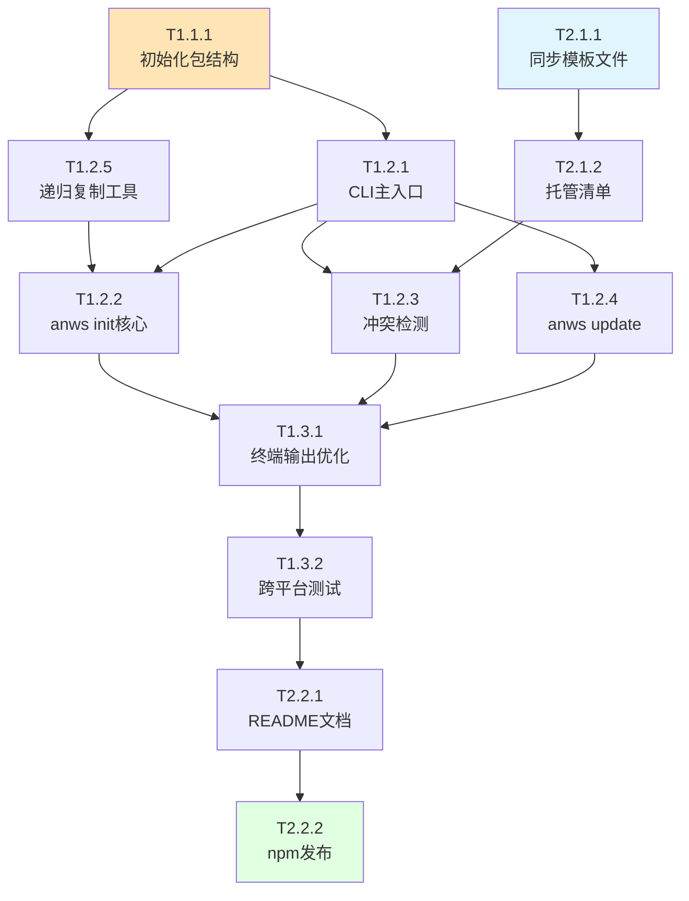

# 05_TASKS — anws CLI 任务清单

**架构版本**: genesis/v1
**生成时间**: 2026-02-25
**总任务数**: 13
**总预估工时**: ~18h

---

## 任务依赖图 (Dependency Graph)



---

## System 1: CLI System

**系统路径**: `src/anws/bin/` + `src/anws/lib/`
**职责**: 命令行参数解析、命令路由、交互确认、文件写入反馈

---

### Phase 1: Foundation (基础设施)

- [ ] **T1.1.1** [REQ-001]: 初始化 npm 包结构
  - **描述**: 在 `src/anws/` 下创建完整的 npm 包骨架，包括 `package.json` (含 bin 字段和 engines 约束)、`.npmignore`、目录结构
  - **输入**: ADR_001_TECH_STACK.md 中的技术决策
  - **输出**: `src/anws/package.json`, `src/anws/.npmignore`, `src/anws/bin/`, `src/anws/lib/`, `src/anws/templates/` 目录结构
  - **验收标准**:
    - [ ] `package.json` 包含 `"name": "anws"`, `"bin": {"anws": "./bin/cli.js"}`, `"engines": {"node": ">=18"}`, `"dependencies": {}`
    - [ ] `.npmignore` 排除开发时不需要发布的文件
    - [ ] 目录结构与架构总览中的物理结构一致
  - **验证说明**: 检查 `package.json` 各字段值，验证 bin 字段路径存在，确认 dependencies 为空对象
  - **估时**: 0.5h
  - **依赖**: 无
  - **优先级**: P0

---

### Phase 2: Core (核心功能)

- [ ] **T1.2.1** [REQ-001]: 实现 CLI 主入口 `bin/cli.js`
  - **描述**: 实现 shebang 行、`parseArgs` 参数解析、`--version` / `--help` 输出、子命令路由 (`init` / `update`)。CommonJS 格式。
  - **输入**: T1.1.1 (包结构)
  - **输出**: `src/anws/bin/cli.js`
  - **验收标准**:
    - [ ] 文件第一行为 `#!/usr/bin/env node`
    - [ ] `node bin/cli.js --version` 输出版本号，退出码 0
    - [ ] `node bin/cli.js --help` 输出命令列表 (init, update)，退出码 0
    - [ ] `node bin/cli.js unknown` 输出 "Unknown command" 并退出码非 0
    - [ ] `node bin/cli.js init` 路由到 init 模块
    - [ ] `node bin/cli.js update` 路由到 update 模块
  - **验证说明**: 逐条在本地执行上述命令，检查输出和退出码
  - **估时**: 1h
  - **依赖**: T1.1.1
  - **优先级**: P0

- [ ] **T1.2.5** [REQ-002]: 实现递归文件复制工具 `lib/copy.js`
  - **描述**: 封装 `fs.cp` (Node 16.7+ 递归复制) 或手写递归复制逻辑，返回已复制的文件路径数组（供打印摘要用）。
  - **输入**: T1.1.1 (包结构)
  - **输出**: `src/anws/lib/copy.js`，导出 `copyDir(src, dest)` 函数
  - **验收标准**:
    - [ ] `copyDir(srcDir, destDir)` 递归复制目录树
    - [ ] 返回已写入的文件列表数组
    - [ ] 目标目录不存在时自动创建（`mkdir -p` 语义）
    - [ ] 使用 `fs.promises`（异步），不阻塞
  - **验证说明**: 用测试目录调用 copyDir，检查目标目录文件数量和内容完整性
  - **估时**: 1h
  - **依赖**: T1.1.1
  - **优先级**: P0

- [ ] **T1.2.2** [REQ-002]: 实现 `anws init` 核心逻辑 `lib/init.js` (无冲突路径)
  - **描述**: 实现当目标目录中**不存在**任何托管文件时，直接将 `templates/.agent/` 写入 `cwd/.agent/` 的完整流程。包含文件写入成功后的摘要输出和 Next Steps 提示。
  - **输入**: T1.2.5 (copy.js), `src/anws/templates/.agent/` (T2.1.1 完成后存在)
  - **输出**: `src/anws/lib/init.js`
  - **验收标准**:
    - [ ] 在无 `.agent/` 的空目录执行，`.agent/` 完整写入
    - [ ] 打印每个写入的文件路径
    - [ ] 最后打印 "✔ Done! N files written" 和 Next Steps
    - [ ] 退出码 0
    - [ ] 无任何用户 prompt（无冲突不应询问）
  - **验证说明**: 在临时测试目录执行 `node bin/cli.js init`，检查 `.agent/` 内容完整性和输出格式
  - **估时**: 1.5h
  - **依赖**: T1.2.1, T1.2.5
  - **优先级**: P0

- [ ] **T1.2.3** [REQ-003]: 实现冲突检测与交互确认逻辑
  - **描述**: 在 `init.js` 中补充冲突检测分支：遍历 `MANAGED_FILES` 清单，若发现**已存在的文件**，通过 `readline` 询问用户 Y/N（默认 N）。用户确认后仅覆盖托管文件，拒绝后 abort 不修改任何文件。
  - **输入**: T1.2.2 (init.js), T2.1.2 (manifest.js)
  - **输出**: 更新 `src/anws/lib/init.js`，完整的冲突处理逻辑
  - **验收标准**:
    - [ ] `.agent/` 已存在且含托管文件时，打印 "⚠ X managed files found. Overwrite? [y/N]"
    - [ ] 用户输入 N 或直接回车 → 打印 "Aborted." 退出码 0，无文件修改
    - [ ] 用户输入 Y → 仅覆盖 MANAGED_FILES 内的文件，用户自有文件不受影响
    - [ ] 用户目录中 `.agent/` 内的非托管文件在 Y 场景下依然存在
    - [ ] stdio 非 TTY（如 CI 环境）时的行为可预期（默认 N，不挂起）
  - **验证说明**: 用预置了混合文件（部分托管+部分用户自有）的测试目录，分别测试 Y/N 路径，检查文件状态
  - **估时**: 2h
  - **依赖**: T1.2.2, T2.1.2
  - **优先级**: P0

- [ ] **T1.2.4** [REQ-004]: 实现 `anws update` 命令 `lib/update.js`
  - **描述**: `update` 与 `init` 的冲突路径逻辑相似，但跳过"首次无冲突"分支。若 `.agent/` 不存在则报错提示运行 init；若存在则直接询问确认后覆盖托管文件。
  - **输入**: T1.2.3 (冲突逻辑), T2.1.2 (manifest.js)
  - **输出**: `src/anws/lib/update.js`
  - **验收标准**:
    - [ ] `.agent/` 不存在时，打印 "No .agent/ found. Run `anws init` first."，退出码非 0
    - [ ] `.agent/` 存在时，打印 "Updating... Overwrite managed files? [y/N]"
    - [ ] 确认后覆盖托管文件，打印已更新文件列表
    - [ ] 用户自有文件不受影响
  - **验证说明**: 测试两种场景（有/无 .agent/），验证输出信息和文件状态
  - **估时**: 1.5h
  - **依赖**: T1.2.1, T1.2.3
  - **优先级**: P1

---

### Phase 3: Polish (优化)

- [ ] **T1.3.1**: 完善终端输出格式
  - **描述**: 统一所有命令的输出风格：使用 `✔` / `⚠` / `✖` Unicode 前缀，用 ANSI 转义码加颜色（绿/黄/红），不引入第三方库。非 TTY 环境自动降级为无颜色输出。
  - **输入**: T1.2.2, T1.2.3, T1.2.4 (所有命令实现完成)
  - **输出**: 更新各命令输出逻辑；可提取公共 `lib/output.js` 模块
  - **验收标准**:
    - [ ] 成功路径输出绿色 `✔`
    - [ ] 警告/确认输出黄色 `⚠`
    - [ ] 错误输出红色 `✖`
    - [ ] `NO_COLOR=1` 或非 TTY 时无颜色（降级）
  - **验证说明**: 在终端中执行各命令，视觉确认颜色和 emoji；用 `| cat` 管道测试非 TTY 降级
  - **估时**: 1h
  - **依赖**: T1.2.2, T1.2.3, T1.2.4
  - **优先级**: P1

- [ ] **T1.3.2** [REQ-001, REQ-005]: 跨平台验证测试
  - **描述**: 在 Windows (PowerShell/cmd) + macOS + Linux 三平台分别验证 `npm install -g .`（本地包）后 `anws init` 的完整可用性。重点检查 Windows 的 shebang 处理和路径分隔符。
  - **输入**: 所有核心功能完成 (T1.2.1 ~ T1.3.1)
  - **输出**: 测试记录（可为 checklist 注释在 README 中）
  - **验收标准**:
    - [ ] Windows: `npm install -g .` 后 `anws --version` 成功
    - [ ] macOS: `anws init` 在空目录完整写入
    - [ ] Linux: `anws update` 在冲突场景正确处理
    - [ ] 三平台路径分隔符无问题（`path.join` 处理）
  - **验证说明**: 在对应平台本地安装并运行，逐一检查输出是否符合预期
  - **估时**: 2h
  - **依赖**: T1.3.1
  - **优先级**: P1

---

## System 2: Template Bundle

**系统路径**: `src/anws/templates/`
**职责**: 存储内嵌的 `.agent/` 工作流模板内容，维护托管文件清单

---

### Phase 1: Foundation (基础设施)

- [ ] **T2.1.1** [REQ-002]: 同步 `.agent/` 模板文件到 `templates/`
  - **描述**: 将当前 Antigravity Workflow System 的 `.agent/` 目录内容完整复制到 `src/anws/templates/.agent/`，作为分发内容的 Source of Truth。
  - **输入**: 当前项目的 `.agent/` 目录 (workflows, skills, rules)
  - **输出**: `src/anws/templates/.agent/` 完整目录
  - **验收标准**:
    - [ ] `templates/.agent/workflows/` 包含所有工作流文件 (genesis.md, blueprint.md, forge.md 等)
    - [ ] `templates/.agent/skills/` 包含所有技能目录
    - [ ] `templates/.agent/rules/agents.md` 存在（内容为模板版本，非当前项目状态）
    - [ ] 文件总数与源 `.agent/` 一致
  - **验证说明**: 比对 `templates/.agent/` 与源 `.agent/` 的文件列表，确认无遗漏
  - **估时**: 0.5h
  - **依赖**: 无
  - **优先级**: P0

- [ ] **T2.1.2** [REQ-003, REQ-004, REQ-007]: 创建托管文件清单 `lib/manifest.js`
  - **描述**: 创建 `lib/manifest.js`，导出 `MANAGED_FILES` 常量数组，列出 `templates/.agent/` 下所有文件的相对路径（格式为 `.agent/xxx`）。此清单是冲突检测的唯一依据。
  - **输入**: T2.1.1 (templates 目录存在)
  - **输出**: `src/anws/lib/manifest.js`，导出完整的文件路径数组
  - **验收标准**:
    - [ ] `MANAGED_FILES` 数组长度与 `templates/.agent/` 实际文件数量一致
    - [ ] 每条路径格式为 `.agent/relative/path`（与目标项目中的相对路径对应）
    - [ ] 模块导出 CommonJS 格式 (`module.exports`)
  - **验证说明**: `require('./manifest.js').MANAGED_FILES.length` 与手动 `find templates/.agent -type f | wc -l` 对比
  - **估时**: 0.5h
  - **依赖**: T2.1.1
  - **优先级**: P0

---

### Phase 2: Distribution (发布)

- [ ] **T2.2.1** [REQ-001, REQ-005]: 编写 README.md
  - **描述**: 编写完整的用户文档，包含：npm 安装方式、命令使用说明（init / update / --help）、GitHub 手动下载说明、冲突处理说明、系统要求。
  - **输入**: 所有核心功能完成且测试通过
  - **输出**: `src/anws/README.md`
  - **验收标准**:
    - [ ] 包含 "Quick Start" 区块（npm install + anws init）
    - [ ] 包含所有子命令的使用示例和说明
    - [ ] 包含 GitHub 手动下载的备选方案说明
    - [ ] 包含 "冲突处理" 说明（哪些文件会被覆盖，哪些不会）
    - [ ] 包含系统要求 (Node.js ≥ 18)
  - **验证说明**: 阅读 README，检查新用户按文档操作能否零障碍完成安装
  - **估时**: 1.5h
  - **依赖**: T1.3.2
  - **优先级**: P1

- [ ] **T2.2.2** [REQ-001]: 发布到 npm Registry
  - **描述**: 完成 npm 账号登录，验证包名 `anws` 可用，执行 `npm publish`，验证发布成功后 `npm install -g anws` 可用。
  - **输入**: T2.2.1 (README 完成), 所有功能测试通过
  - **输出**: npm 上公开可用的 `anws` 包
  - **验收标准**:
    - [ ] `npm login` 登录成功
    - [ ] `npm publish --access public` 无报错
    - [ ] `npm view anws version` 返回正确版本号
    - [ ] 在全新机器执行 `npm install -g anws && anws --version` 成功
  - **验证说明**: 在独立的测试机/容器中执行 `npm install -g anws`，验证完整安装和 init 流程
  - **估时**: 0.5h（假设账号已准备）
  - **依赖**: T2.2.1, T1.3.2
  - **优先级**: P1

---

## 任务统计

| 优先级 | 数量 | 预估工时 |
|--------|------|---------|
| P0 | 6 | ~7h |
| P1 | 7 | ~11h |
| **合计** | **13** | **~18h** |

## P0 任务执行顺序

```
T1.1.1 → T2.1.1 → T2.1.2
            ↓          ↓
T1.2.5 → T1.2.1 → T1.2.2 → T1.2.3
```

## 下一步行动

1. 从 **T1.1.1** 开始（初始化包结构）
2. 并行推进 **T2.1.1**（同步模板文件）
3. 所有 P0 完成后进行 P1 优化和发布
4. 可选：运行 `/design-system` 生成 `04_SYSTEM_DESIGN/cli-system.md` 详细设计
